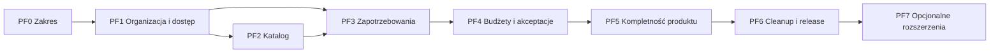

# ProcureFlow: roadmap produktu

## Cel dokumentu

Ta roadmapa prowadzi istniejący starter do `ProcureFlow v1.0.0`: wewnętrznego
systemu B2B do obsługi zapotrzebowań zakupowych w firmie posiadającej wiele
oddziałów.

Priorytetem jest szybkie zbudowanie spójnego projektu portfolio na poziomie
junior+, a nie rozbudowanego systemu ERP. Największą wartością projektu mają być:

- reguły biznesowe zapisane w modelu domenowym;
- autoryzacja zależna od organizacji i oddziału;
- kontrolowany workflow zapotrzebowania;
- budżet miesięczny i bezpieczna obsługa równoległych akceptacji;
- transakcje, optimistic concurrency i testy na PostgreSQL;
- działający przepływ użytkownika od formularza do dostarczenia zamówienia.

## Jak czytać etapy

Oznaczenia `PF0`, `PF1` itd. opisują kolejność prac nad produktem. Nie są
numerami wydań semver i nie zastępują tagu `v1.0.0`.

Dotychczasowe pliki `V1-V8` w katalogu nadrzędnym pozostają dokumentacją
dojrzałości technicznej startera. Ta roadmapa jest natomiast kanoniczną
kolejnością budowania domeny ProcureFlow.

## Zakres `v1.0.0`

Pierwsza wersja obejmuje:

- jedną organizację i wiele oddziałów;
- przypisanie użytkownika do oddziału oraz role biznesowe;
- katalog kategorii, jednostek miary i produktów;
- tworzenie draftu zapotrzebowania i zarządzanie pozycjami;
- wysłanie, anulowanie, zatwierdzenie i odrzucenie wniosku;
- eskalację ponad limit budżetu oddziału;
- oznaczenie wniosku jako zamówiony i dostarczony;
- historię decyzji, powiadomienia i załączniki;
- prosty dashboard z czterema wskaźnikami;
- najważniejszy przepływ przetestowany przez API, PostgreSQL i przeglądarkę.

## Decyzje upraszczające MVP

- Jedna organizacja jest wspierana funkcjonalnie; pełna izolacja wielu firm jest
  poza zakresem `v1.0.0`.
- `UserRole` pozostaje rolą platformową. `Employee`, `Manager` i `Procurement`
  są rolami członkostwa biznesowego, a nie globalnymi rolami konta.
- Użytkownik należy najwyżej do jednego oddziału w MVP. Obsługa wielu oddziałów
  dla jednej osoby może zostać dodana później.
- System przechowuje orientacyjne ceny, ale nie prowadzi stanów magazynowych,
  faktur ani płatności.
- `PurchaseRequest` jest osobnym agregatem i nie jest zmianą nazwy `ProjectTask`.
- Akceptacje i decyzje budżetowe pozostają częścią modułu `PurchaseRequests`,
  dopóki nie powstanie rzeczywista potrzeba niezależnego modułu `Approvals`.
- Backend pozostaje modularnym monolitem z jednym `ApplicationDbContext` i jedną
  bazą PostgreSQL.
- Frontend ma być kompletny dla krytycznego workflow, ale nie wymaga osobnego
  design systemu ani rozbudowanych animacji.

## Stan wyjściowy

Stan na: **2026-09-02**.

Projekt ma gotowy fundament techniczny: auth, sesje, 2FA, spójne błędy API,
PostgreSQL, testy integracyjne, optimistic concurrency, powiadomienia, email
outbox, pliki, observability, Docker oraz CI/CD. Funkcje `Projects` i
`ProjectTasks` są nadal działającą domeną demonstracyjną. Pozostają na miejscu
do czasu, aż zastępujący je przepływ ProcureFlow przejdzie testy.

Gotowy fundament nie oznacza gotowego produktu. Postęp ProcureFlow należy liczyć
według etapów poniżej, nie według starej roadmapy startera.

## Kolejność etapów

| Etap | Cel | Status | Dokument |
|---|---|---|---|
| PF0 | Zamrożenie zakresu i decyzji domenowych | Ukończony przez tę roadmapę | [01_PF0_SCOPE_AND_DECISIONS.md](01_PF0_SCOPE_AND_DECISIONS.md) |
| PF1 | Organizacja, oddziały i dostęp do zasobów | Następny | [02_PF1_ORGANIZATION_AND_ACCESS.md](02_PF1_ORGANIZATION_AND_ACCESS.md) |
| PF2 | Katalog produktów | Planowany | [03_PF2_CATALOG.md](03_PF2_CATALOG.md) |
| PF3 | Draft i wysłanie zapotrzebowania | Planowany | [04_PF3_PURCHASE_REQUEST_CORE.md](04_PF3_PURCHASE_REQUEST_CORE.md) |
| PF4 | Budżety, zatwierdzanie i concurrency | Planowany | [05_PF4_APPROVALS_AND_BUDGETS.md](05_PF4_APPROVALS_AND_BUDGETS.md) |
| PF5 | Realizacja, kompletność produktu i E2E | Planowany | [06_PF5_PRODUCT_COMPLETENESS.md](06_PF5_PRODUCT_COMPLETENESS.md) |
| PF6 | Usunięcie domeny demo i release `v1.0.0` | Planowany | [07_PF6_CLEANUP_AND_RELEASE.md](07_PF6_CLEANUP_AND_RELEASE.md) |
| PF7 | Rozszerzenia po MVP | Opcjonalny | [08_PF7_POST_MVP_OPTIONS.md](08_PF7_POST_MVP_OPTIONS.md) |

## Kanoniczna kolejność branchy

Każdy branch powinien kończyć się działającym, niezależnie poprawnym stanem.
Nie należy otwierać kilku branchy domenowych równolegle.

| Kolejność | Branch | Wynik |
|---:|---|---|
| 0 | `docs/procureflow-product-roadmap` | Zakres, etapy i kolejność implementacji |
| 1 | `feature/organization-branches` | Organizacja i CRUD oddziałów |
| 2 | `feature/branch-access-control` | Członkostwa i role zasobowe |
| 3 | `feature/catalog-management` | Kategorie, jednostki i produkty |
| 4 | `feature/purchase-request-drafts` | Agregat, draft i pozycje |
| 5 | `feature/purchase-request-submission` | Wysłanie i anulowanie wniosku |
| 6 | `feature/branch-monthly-budgets` | Limity i bezpieczna rezerwacja budżetu |
| 7 | `feature/purchase-request-approvals` | Akceptacja, odrzucenie i eskalacja |
| 8 | `feature/procurement-fulfillment` | Statusy `Ordered` i `Delivered` |
| 9 | `feature/purchase-request-attachments` | Załączniki wniosku |
| 10 | `feature/purchase-request-notifications` | Powiadomienia i kompletna historia zdarzeń |
| 11 | `feature/procureflow-dashboard` | Cztery wskaźniki biznesowe |
| 12 | `test/procureflow-critical-flow-e2e` | Krytyczny przepływ przez przeglądarkę |
| 13 | `refactor/remove-project-management-demo` | Usunięcie `Projects/ProjectTasks` po zastąpieniu |
| 14 | `docs/procureflow-release-documentation` | Aktualna dokumentacja produktu i API |
| 15 | `chore/procureflow-v1-release-readiness` | Pełna walidacja release candidate |

Branch może obejmować backend, frontend, testy i dokumentację potrzebne do jednego
przypadku użycia. Nie należy dzielić jednej funkcji na osobne branche typu
`backend/...` i `frontend/...`, ponieważ tworzyłoby to niedziałające stany pośrednie.

## Zależności

## Minimalny standard brancha

Każdy branch funkcjonalny powinien zawierać tylko elementy potrzebne do swojego
przypadku użycia:

1. regułę lub kontrakt wejściowy;
2. implementację vertical slice;
3. autoryzację po stronie serwera;
4. migrację EF Core, jeśli zmienia się schema;
5. testy jednostkowe reguł domenowych;
6. test API lub PostgreSQL odpowiedni do ryzyka;
7. minimalny frontend, jeśli funkcja jest widoczna użytkownikowi;
8. aktualizację dokumentacji dotkniętego przepływu.

Po branchu uruchamiane są testy dotkniętego modułu. Po zakończeniu całego etapu
należy uruchomić pełny build backendu, testy frontendu i odpowiednią część testów
integracyjnych. Pełny `scripts/Invoke-E2ETests.ps1` jest obowiązkowy przed PF6.

## Definicja `ProcureFlow v1.0.0`

Release jest gotowy dopiero wtedy, gdy:

- Employee tworzy draft, dodaje pozycje i wysyła zapotrzebowanie;
- Manager widzi wyłącznie właściwy oddział i nie zatwierdza własnego wniosku;
- zwykła akceptacja atomowo aktualizuje budżet;
- przekroczenie limitu wymaga decyzji Procurement;
- odrzucenie zawsze posiada przyczynę;
- Procurement oznacza zaakceptowany wniosek jako zamówiony i dostarczony;
- nieaktualna mutacja kończy się `409 Conflict`;
- historia i powiadomienia wskazują aktora, czas i wynik operacji;
- dashboard liczy dane po stronie PostgreSQL;
- domena demonstracyjna projektów i zadań nie jest częścią interfejsu produktu;
- buildy, testy oraz repozytoryjna i stagingowa bramka release przechodzą.

## Czego nie dodawać przed `v1.0.0`

- pełnego multi-tenancy;
- konfigurowalnego silnika workflow;
- integracji z ERP, kurierem, płatnościami lub księgowością;
- magazynu i rezerwacji stanów;
- marketplace dostawców;
- mikroserwisów, brokera wiadomości lub Event Sourcingu;
- Kubernetes;
- rozbudowanego design systemu;
- optymalizacji bez pomiaru.

Jeśli nowe wymaganie nie jest konieczne do krytycznego przepływu, trafia do PF7,
a nie do aktywnego brancha.