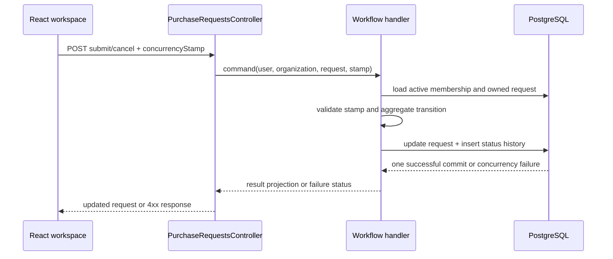

# PF3: Purchase Request Submission Workflow

## Status

In progress on the purchase-request workflow slice.

This document records the implementation boundary for:

```text
Draft -> Submitted
Draft -> Cancelled
Submitted -> Cancelled
```

Approval, rejection, budgets, procurement fulfillment, notifications and
configurable workflow remain outside this slice.

## Business Goal

An Employee must be able to finish an author-owned purchase-request draft and
submit it for the next workflow stage. The author must also be able to cancel a
draft or submitted request before approval. The server remains the owner of
status, totals, prices, scope and concurrency decisions.

## Actors and Ownership

- Employee: creates, edits, submits and cancels own requests in the active
  branch scope.
- PurchaseRequest aggregate: owns lifecycle transitions and draft editability.
- Application handler: resolves membership, authorizes the actor, checks the
  expected version and coordinates persistence.
- Infrastructure store: loads the scoped aggregate, stages a status-history
  row and commits the aggregate plus history in one `SaveChangesAsync` call.
- API: binds the concurrency request, maps application outcomes to HTTP status
  codes and never decides business transitions.
- React client: presents actions based on server status and reloads after a
  `409 Conflict`.

## Invariants

1. `Submit` is allowed only from `Draft`.
2. A request must contain at least one item before submission.
3. `Cancel` is allowed only from `Draft` or `Submitted`.
4. A request in `Submitted` or `Cancelled` state cannot be edited.
5. Each status mutation requires the current `ConcurrencyStamp`.
6. A stale version returns `409 Conflict` and does not append history.
7. The status transition and its history row are committed atomically.
8. The client cannot provide or override the resulting status.
9. Only an active Employee membership in the request scope can use these
   author-owned actions.

## Persistence Decision

The project has no purchase-request status-history entity. `ProjectActivity`
is intentionally not reused because it belongs to the Projects bounded context
and carries project-specific relationships.

The workflow adds `PurchaseRequestStatusHistory` with:

- request identifier;
- previous status;
- next status;
- actor user identifier;
- UTC change timestamp.

History rows represent transitions. The first row is created by a successful
submit or cancel operation; draft creation itself remains a request creation,
not a lifecycle transition.

One EF Core `SaveChangesAsync` call is sufficient for atomicity because the
request update and history insert are tracked in the same DbContext transaction.
A PostgreSQL integration test verifies the persisted transition.

## API Contract

```text
POST /api/organizations/{organizationId}/purchase-requests/{requestId}/submit
POST /api/organizations/{organizationId}/purchase-requests/{requestId}/cancel
```

Request body:

```json
{
  "concurrencyStamp": "current-server-version"
}
```

Expected outcomes:

- `200 OK`: returns the updated request projection;
- `400 Bad Request`: missing version or incomplete draft submission;
- `401 Unauthorized`: missing or invalid authenticated user;
- `403 Forbidden`: actor is not an Employee in the active branch scope;
- `404 Not Found`: request is outside the actor's author-owned scope;
- `409 Conflict`: stale version or invalid lifecycle transition.

The list endpoint accepts an optional `status` query parameter and keeps the
existing author-and-branch scope:

```text
GET /api/organizations/{organizationId}/purchase-requests?status=Submitted
```

## Data Flow



## Implementation Checkpoints

1. Domain: add `Submit` and `Cancel`; cover empty, valid and repeated
   transitions with unit tests.
2. Persistence: add the history entity, EF configuration, DbSet and migration.
3. Application/infrastructure: add commands, focused workflow store, handlers,
   status-filtered list query and concurrency handling.
4. API: add request validation and submit/cancel endpoints with OpenAPI status
   metadata.
5. Frontend: add status filtering, submit/cancel actions, read-only rendering
   after submission/cancellation and conflict reload behavior.
6. Verification: run focused domain/handler tests, API integration tests,
   PostgreSQL history/concurrency tests, frontend tests, builds and the final
   relevant suite.

## Test Matrix

| Area | Required evidence |
| --- | --- |
| Domain | Empty submit rejected; valid submit changes status; draft/submitted cancel succeeds; repeated transitions fail; submitted requests are immutable. |
| Handler | Employee scope is required; stale stamp is rejected before mutation; successful transition saves exactly once; invalid transition does not save. |
| API | Submit and cancel return updated projections; unauthorized and forbidden access are mapped correctly; status filter is passed to the store. |
| PostgreSQL | History row persists with actor and from/to statuses; request and history are committed together; stale concurrent writer returns `409`; cancelled request cannot be submitted. |
| Frontend | Actions are visible only for allowed states; submitted/cancelled details are read-only; filter sends status; `409` reloads the server version. |

## Definition of Done

- [ ] Domain transitions and tests are complete.
- [ ] Status history table and migration are present.
- [ ] Submit/cancel API is documented and tested.
- [ ] Status-filtered request list is available.
- [ ] Frontend supports submit/cancel and read-only states.
- [ ] Focused and full relevant tests pass.
- [ ] Backend and frontend builds pass.
- [ ] Remaining PF3 limitations are documented.

## Future Extension Points

- Manager approval can add `Submitted -> Approved/Rejected` without changing
  the submit/cancel invariants.
- Notifications can consume successful transition events after a durable
  outbox boundary is selected.
- A history read endpoint can be added when the product needs an audit timeline.
- Budget reservation must be introduced as a separate transactional concern in
  PF4 rather than hidden inside this slice.
