# Slice: Assign membership

## 0. Metadata

```text
Slice: AssignMembership
Technical operation: CreateMembership
Status: Implemented; PostgreSQL execution blocked locally
Branch: feature/branch-access-control
Owner: Organization/Membership module
Date: implementation complete
Source documents: FEATURE_BRIEF.md, FILE_PLAN.md, TEST_PLAN.md, OPEN_QUESTIONS.md
```

This slice uses the business name `AssignMembership` because the actor grants
access. The existing code uses the technical operation name `CreateMembership`.
Keep the existing technical name unless a later decision requires a coordinated
rename across the module.

## 1. Business problem

A global administrator needs to grant one active user access to an active
organization and, when required by the business role, to one active branch.
Without this operation, later catalog and purchase-request handlers cannot
resolve a trustworthy organization or branch access context.

This slice is successful when one valid active membership is created, its role
and branch combination is valid, its organization and branch scope has been
verified on the backend, and the API returns the created membership.

## 2. Verified facts, assumptions and decision gates

### Facts verified in the implemented repository

- `Domain.Models.Organizations.Membership` already owns the role/branch
  invariant and starts a new membership as active.
- `BusinessRole` already contains `Employee`, `Manager` and `Procurement`.
- The Application and Infrastructure Create contracts already exist.
- The API exposes create, list, update, archive and current-membership
  endpoints, all with explicit authorization boundaries.
- `OrganizationModule` registers the membership handlers and stores.
- `OrganizationMembershipConfiguration` protects one active membership per
  user with the filtered unique index `UX_Memberships_ActiveUser`.
- The migration history and model snapshot contain the `Memberships` table,
  foreign keys and the active-membership index.
- `GetActiveBranchAsync` filters both organization ownership and archived
  branches.
- Existing organization endpoints use `[Authorize(Roles = "Admin")]` and
  route organization scope as `api/organizations/{organizationId}/...`.

### Decisions implemented by this slice

- The MVP permits at most one active membership for a user across the system.
- A global technical `Admin` manages memberships; business roles are not
  platform authorization roles.
- Deactivation is represented by archive/deactivate and preserves history.
- The route parameter is the source of truth for `OrganizationId`; the request
  body should not repeat it.

### Resolved decision gates

| ID | Decision needed | Default for this slice | Evidence or owner |
| --- | --- | --- | --- |
| BAC-001 | Repeated active assignment | Return `409 Conflict`, including a database race | Application result and filtered unique index |
| BAC-003 | Membership management policy | Reuse `[Authorize(Roles = "Admin")]` | Management controllers |
| BAC-004 | Scope hiding policy | Return `404` for a missing, inactive or wrong-scope resource | Scoped store queries and API tests |
| BAC-005 | Stale access behavior | Current-membership endpoint reads active state from the database | Current handler/store and integration test |
| BAC-006 | Archived current branch | Preserve membership history; active branch is required for branch-scoped work | Archive semantics and branch query |

If a future product decision changes one of these defaults, update
`OPEN_QUESTIONS.md` and this file together.

## 3. Actor and resource scope

```text
Actor: authenticated global technical Admin
Resource: one organization membership assignment
Organization scope: organizationId from the route; organization must be active
Branch scope: optional for Procurement, required for Employee and Manager
Authentication required: Yes
Authorization rule: current repository Admin role policy, pending BAC-003 confirmation
```

The client-provided `UserId` and optional `BranchId` identify targets. They do
not prove that the targets are valid or in the selected organization. The
handler/store must verify all target relationships from current database state.

## 4. Preconditions

The operation may proceed only when:

- the request is authenticated;
- the caller satisfies the membership-management policy;
- the target organization exists and is not archived;
- the target user exists and is active;
- the requested role is a defined `BusinessRole` value;
- `Employee` and `Manager` have a non-empty `BranchId`;
- `Procurement` has no `BranchId`;
- when `BranchId` is present, the branch exists, is not archived, and belongs to
  the route organization;
- the target user has no active membership under the MVP rule.

A missing branch, an archived branch, and a branch belonging to another
organization must not be treated as a valid assignment.

## 5. Input and output contract

### Request

```text
HTTP method: POST
HTTP route: /api/organizations/{organizationId:guid}/memberships
Route values: organizationId
Request body: userId, branchId, role
```

Recommended JSON shape:

```json
{
  "userId": "00000000-0000-0000-0000-000000000000",
  "branchId": "00000000-0000-0000-0000-000000000000",
  "role": 2
}
```

`branchId` is `null` for `Procurement`. `organizationId` is intentionally absent
from the body; the route value is mapped into the command. This leaves one
organization scope source and prevents a route/body mismatch.

The numeric `role` example follows the current default enum serialization. The
validator performs basic shape checks; the domain remains the owner of the
role/branch combination rule.

### Successful response

```text
Status: 201 Created
Body: ApiResponse<CreateMembershipResponse>
State changes: one new active Membership
Database writes: one row in Memberships
```

The response should expose `Id`, `OrganizationId`, `UserId`, `BranchId`, `Role`
and `IsActive`. The API owns the response DTO; it should map from the existing
`MembershipView` rather than expose a Domain entity.

### Failure response

| Situation | Application result | HTTP result |
| --- | --- | --- |
| No access token | Not handled by the handler | `401 Unauthorized` |
| Authenticated caller is not allowed to manage memberships | Policy failure | `403 Forbidden` |
| Invalid route/body shape or undefined role | `ValidationError` | `400 Bad Request` |
| Organization does not exist | `NotFound` | `404 Not Found` |
| Organization is archived | `Conflict` | `409 Conflict` |
| User does not exist or is inactive | `NotFound` | `404 Not Found` |
| Branch does not exist, is archived or is outside organization scope | `NotFound` | `404 Not Found` |
| Role/branch combination is invalid | `ValidationError` | `400 Bad Request` |
| User already has an active membership | `Conflict` | `409 Conflict` |
| Concurrent request violates the active-membership constraint | `Conflict` after existing PostgreSQL error classification | `409 Conflict` |

Use the application status from `MembershipResult<T>` and map it to HTTP in the
API layer with the existing `OperationResultStatusCodeMapper` pattern. Keep the
existing `PostgreSqlErrorClassifier` pattern. The Application layer returns an
application result; it does not return HTTP status codes or `IActionResult`.

## 6. Invariants

| Invariant | Owner | Protection |
| --- | --- | --- |
| `Employee` and `Manager` require a branch | Domain | `Membership` constructor and domain unit tests |
| `Procurement` is organization-wide and has no branch | Domain | `Membership` constructor and domain unit tests |
| A new membership is active | Domain | `Membership` constructor and handler test |
| Organization is active before assignment | Application handler | Organization lookup and handler test |
| Target user is active before assignment | Application handler/store | Active-user query and handler/API test |
| Branch belongs to the route organization and is active | Application handler/store | Scoped active-branch lookup and handler/API test |
| A user has at most one active membership in the MVP | PostgreSQL plus application check | Partial unique index on active `UserId`, race-condition integration test |
| Membership points to existing organization, user and branch when present | PostgreSQL | Foreign keys and PostgreSQL integration test |
| Only an allowed caller can assign access | API/authentication | Authorization attribute/policy and `401`/`403` tests |
| Client-supplied identifiers cannot bypass scope | Application handler/store | Scope test using a branch from another organization |

The application pre-check improves the normal error message. The PostgreSQL
constraint is still required because two concurrent requests can both pass the
pre-check.

## 7. Simplified flow

```mermaid
flowchart LR
  Request["POST /api/organizations/{organizationId}/memberships"]
    --> Api["API<br/>authentication + Admin authorization<br/>route/body binding"]
  Api --> Command["CreateMembershipCommand"]
  Command --> Handler["CreateMembershipHandler"]
  Handler --> Scope["Active organization + user + branch<br/>branch belongs to organization"]
  Scope --> Domain["Domain Membership<br/>role/branch invariant"]
  Domain --> Persistence["EF Core / PostgreSQL<br/>foreign keys + active uniqueness"]
  Persistence --> Result["MembershipResult&lt;MembershipView&gt;"]
  Result --> Response["CreateMembershipResponse<br/>201 or mapped failure"]
```



Important decisions:

- API owns HTTP binding and authorization.
- The handler coordinates cross-aggregate checks.
- `Membership` owns the role/branch state invariant.
- PostgreSQL owns the final uniqueness and referential-integrity guarantee.

The diagram communicates the relationship at a glance. The sections below are
the authoritative source for exact paths, failure statuses and implementation
actions.

## 8. Existing code reconciliation

| Path | Classification | Current responsibility | Planned action |
| --- | --- | --- | --- |
| `backend/Domain/Models/Organizations/Membership.cs` | REUSE | Membership state and role/branch validation | Keep as the domain owner; add focused tests only if coverage is missing |
| `backend/Domain/Models/Organizations/Enums/BusinessRole.cs` | REUSE | Business role values | Keep; do not move these roles into global `UserRole` |
| `backend/Domain/Models/Organizations/Enums/MembershipOperationStatus.cs` | REUSE | Application outcome statuses | Keep existing statuses and mapping |
| `backend/Application/Modules/Organization/Membership/MembershipResult.cs` | REUSE | Generic application result with application status, value and message | Keep the application contract free of HTTP metadata |
| `backend/API/Responses/OperationResultStatusCodeMapper.cs` | IMPLEMENTED | Maps application outcomes to HTTP status codes | Keep HTTP mapping in the API layer |
| `backend/Application/Modules/Organization/Membership/MembershipView.cs` | REUSE | Application output view | Reuse as the handler output |
| `backend/Application/Modules/Organization/Membership/Create/CreateMembershipCommand.cs` | REUSE | Command includes organization, user, branch and role | Build organization scope from the route; do not trust a duplicate body field |
| `backend/Application/Modules/Organization/Membership/Create/ICreateMembershipHandler.cs` | REUSE | Create use-case port | Keep |
| `backend/Application/Modules/Organization/Membership/Create/ICreateMembershipStore.cs` | REUSE | Loads organization, user, branch and active-membership state | Keep the focused port and scoped active-branch lookup |
| `backend/Infrastructure/Modules/Organization/Membership/Create/CreateMembershipHandler.cs` | IMPLEMENTED | Coordinates creation and maps domain/database errors | Enforces scope, role rules and concurrent uniqueness conflict |
| `backend/Infrastructure/Modules/Organization/Membership/Create/EfCreateMembershipStore.cs` | IMPLEMENTED | EF Core reads and write | Filters active user and active branch state in the store |
| `backend/API/Modules/Organization/Membership/Create/CreateMembrshipRequest.cs` | IMPLEMENTED | HTTP request record; filename contains a typo | Body contains user, branch and role; organization scope comes from the route |
| `backend/API/Modules/Organization/Membership/Create/CreateMembershipValidator.cs` | IMPLEMENTED | Basic request validation | Validates request shape and conditional branch presence |
| `backend/API/Modules/Organization/Membership/Create/CreateMembershipController.cs` | IMPLEMENTED | Membership assignment endpoint | Maps route, authorization, command and response |
| `backend/API/Modules/Organization/Membership/MembershipResponse.cs` | IMPLEMENTED | Shared API response contract | Maps from `MembershipView`; does not expose the domain entity |
| `backend/Infrastructure/Modules/Organization/OrganizationModule.cs` | IMPLEMENTED | Registers organization module dependencies | Registers all membership handlers and stores |
| `backend/Infrastructure/Data/Configurations/Organization/Membership/OrganizationMembershipConfiguration.cs` | IMPLEMENTED | Maps membership relationships and indexes | Foreign keys plus filtered active-user uniqueness |
| `backend/Infrastructure/Data/Migrations/20260920143045_AddOrganizationMemberships.cs` | IMPLEMENTED | Creates membership persistence | Creates the table, foreign keys and active-membership index |
| `backend/UnitTests/Modules/Organization/Membership/*` | IMPLEMENTED | Membership handler tests | Covers valid and cross-aggregate failure paths |
| `backend/UnitTests/Models/Organizations/MembershipTests.cs` | IMPLEMENTED | Membership domain tests | Covers role/branch combinations and state changes |
| `backend/IntegrationTests/MembershipsApiInMemoryIntegrationTests.cs` | IMPLEMENTED | Fast API coverage | Covers authorization, creation, current context and scope hiding |
| `backend/IntegrationTests/MembershipsApiIntegrationTests.cs` | IMPLEMENTED | PostgreSQL API/constraint coverage | Covers database uniqueness, history and concurrent assignment; execution requires Docker |
| `frontend/src/pages/OrganizationMemberships.tsx` | IMPLEMENTED | Admin membership-management workflow | Covers loading, empty, error, assignment, update and archive states |

## 9. File plan

The following implementation surfaces belong to the delivered membership
vertical slice:

```text
Domain:
    reuse Domain.Models.Organizations.Membership
    reuse BusinessRole and MembershipOperationStatus
    create focused Membership domain tests

Application:
    reuse CreateMembershipCommand, handler port and store port
    reuse MembershipResult and MembershipView

Infrastructure:
  implement create, list, current, update and archive handlers/stores
  register the membership module
  modify OrganizationMembershipConfiguration
  create the Memberships migration

API:
  implement create, list, current, update and archive controllers
  validate requests and map MembershipView responses

Tests:
  membership domain and handler tests
  InMemory API tests for authorization, scope and current context
  PostgreSQL API, foreign-key, history and concurrency tests
  frontend page tests
```

Do not create another `Membership` entity, another generic permission system,
or a second current-user context port in this slice.

## 10. Test plan

### Cheapest proving test

```text
Create a Manager membership for User U in Branch A.
Attempt the same assignment for Branch B or a branch from another organization.
Expected: the assignment is rejected and no Membership row is written.
```

This is the first proving test because branch ownership is the highest-risk
security assumption in this slice. A valid assignment test alone would not show
that a client cannot smuggle an unrelated branch identifier into the request.

### Behavior matrix

| Behavior | Test | Expected proof |
| --- | --- | --- |
| Valid `Manager` assignment | Handler test | Active organization, user and branch produce one active membership |
| Valid `Procurement` assignment | Domain plus handler test | `BranchId` may be null and the membership remains organization-scoped |
| Employee/Manager without branch | Domain or handler test | Operation fails with `400`-mapped validation result |
| Procurement with branch | Domain or handler test | Operation fails with `400`-mapped validation result |
| Inactive organization | Handler/API integration | No membership is added; result is `409` by current convention |
| Inactive user | Handler/API integration | No membership is added; result is `404` |
| Archived branch | Handler/API integration | No membership is added; result is `404` |
| Branch from another organization | Handler/API integration | No membership is added; scope is not accepted |
| Existing active membership | Handler/API integration | No second active membership is added; result is `409` |
| Missing token | API integration | `401 Unauthorized` |
| Non-Admin caller | API integration | `403 Forbidden` |
| Concurrent duplicate assignment | PostgreSQL integration | Partial unique index rejects the race and the handler maps it to conflict |
| Foreign-key integrity | PostgreSQL integration | Invalid organization/user/branch references cannot be persisted |
| DI registration | Module architecture test or service resolution | Create handler and store resolve from the module container |
| Endpoint uniqueness | Existing architecture test | New route does not duplicate another HTTP route |

## 11. Validation record

```text
Domain and handler rules
  -> implemented and covered by 371 passing UnitTests

Application, infrastructure and API
  -> implemented; API and module architecture builds/tests pass

InMemory API validation
  -> 4 membership tests pass, including authorization and scope hiding

Frontend validation
  -> 5 page tests plus typecheck and production build pass

PostgreSQL validation
  -> tests are implemented, including unique-index history and concurrency
  -> execution is blocked until Docker Engine is available
```

The PostgreSQL block is environmental rather than a known implementation
failure. Run the focused PostgreSQL test class after starting Docker.

## 12. Definition of done

- [x] The business operation is named `AssignMembership`; the technical
      operation is reconciled with existing `CreateMembership` code.
- [x] BAC-001, BAC-003 and BAC-004 have explicit decisions recorded.
- [x] Existing code was reconciled before adding files.
- [x] A duplicate Membership entity or generic permission abstraction was not added.
- [x] Domain tests prove every role/branch combination.
- [x] Active organization, user and branch checks are enforced on the backend.
- [x] Branch ownership is checked against the route organization.
- [x] PostgreSQL protection and foreign-key migration are implemented.
- [x] The API returns `401`, `403`, `400`, `404`, `409` and `201` according to the contract.
- [x] The API does not trust a duplicate organization id from the body.
- [x] DI registration and route discovery tests pass.
- [x] InMemory scope and authorization proving tests pass.
- [x] Focused builds and executable tests pass where the environment is available.
- [ ] PostgreSQL/Testcontainers execution is pending Docker Engine availability.
- [ ] The user can explain the flow and failure paths without generated code.

## 13. Teach-back

After implementation, answer without looking at the code:

1. Why is the business name `AssignMembership` while the current technical name is `CreateMembership`?
2. Which checks belong to `Membership`, and which checks require the handler/store?
3. Why is the route organization id safer than accepting a second organization id in the body?
4. Why is the application duplicate check not enough without a PostgreSQL constraint?
5. How does the system reject a branch from another organization?
6. Why must `GetActiveBranchAsync` filter archived branches?
7. Which response is returned for an unauthenticated caller, a non-Admin caller and an existing active membership?
8. Which existing files were reused, and which missing boundary required a new file?
9. What would need to change if one user could belong to multiple organizations?
10. Which test proves the most important security risk in this slice?
