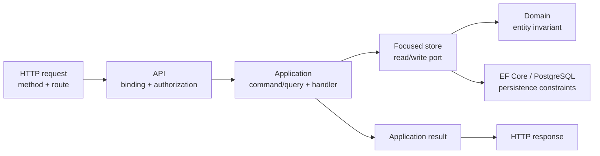
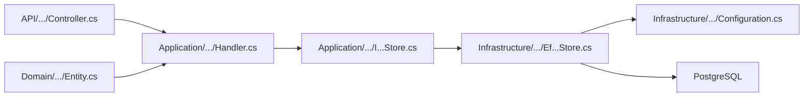
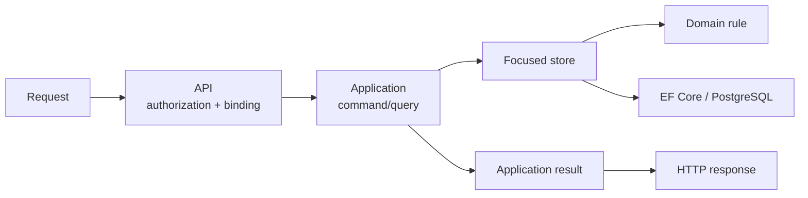
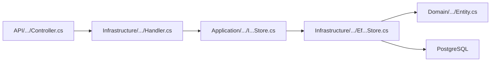

# Slice template

Use this file as a small design document for one use case. Do not describe the
whole branch here. A slice should be small enough to implement, test and explain
in one focused work session.

## Diagram convention

Use Mermaid for relationships and flows that are easier to understand visually.
The Mermaid source is still plain text, so both a human and an AI can read it.
Keep the exact file paths, contracts and rules in prose, tables or `text` blocks;
the diagram is a visual index, not the only source of truth.

Use these diagram types consistently:

```text
flowchart LR       request, data or dependency flow
flowchart TD       lifecycle or decision flow
sequenceDiagram   request timeline between actors and components
classDiagram      domain relationships, only when the class relation matters
```

Prefer explicit node labels and stable direction. Do not encode an important
rule only with color, position or an icon. For a file plan, use Mermaid to show
responsibility between layers and keep the exact paths in the file table.

Reusable slice flow:



Reusable file-responsibility flow:



For AI-assisted work, place the diagram next to a short explanation of the
important decision and a file table. This gives the model both the relationship
graph and the exact implementation contract.

## 0. Metadata

```text
Slice:
Status: Draft | Planned | In progress | Validated | Blocked | Deferred
Branch:
Owner:
Date:
Source documents:
```

## 1. Business problem

Write two or three sentences:

```text
The user/business needs ...
Without this slice ...
This slice is successful when ...
```

Avoid starting with class names or database tables. Start with the behavior.

## 2. Actor and resource scope

```text
Actor:
Resource:
Organization scope:
Branch scope:
Authentication required: Yes | No
Authorization rule:
```

Answer who acts, which resource is changed, and how the backend proves that the
resource belongs to the allowed organization or branch.

## 3. Preconditions

List facts that must be true before the operation starts:

- authenticated user exists;
- caller has the required platform or business permission;
- organization is active;
- branch belongs to the organization and is active;
- target user is active;
- the target resource exists.

Remove items that do not apply. Do not add generic checks only because they look
professional.

## 4. Input and output contract

### Request

```text
HTTP method and route:
Request body:
Required fields:
Optional fields:
Validation rules:
```

### Successful response

```text
Status:
Response body:
State changes:
Database writes:
```

### Failure response

| Situation | Application result | HTTP result |
| --- | --- | --- |
| Not authenticated | ... | `401` |
| Not authorized | ... | `403` |
| Resource not found or outside scope | ... | `404` or documented safe result |
| Invalid business state | ... | `400`, `409` or repository convention |

The application layer must not return `IActionResult`. It returns an application
result; the API maps that result to HTTP.

## 5. Invariants

Write rules that must never be false after a successful operation:

```text
1. ...
2. ...
3. ...
```

For every invariant, name its owner:

| Invariant | Owner | Protection |
| --- | --- | --- |
| Entity state is valid | Domain | Entity method and unit test |
| Related resource belongs to organization | Application/store | Scoped query and handler test |
| Value is unique | PostgreSQL | Unique constraint/index and integration test |
| Endpoint is restricted | API/authentication | Policy and API test |

## 6. Simplified flow

Use a short Mermaid diagram before writing code. Label the node with the
responsibility, not only the class name:



Mark where the important decision is made. A controller should not be the owner
of a domain invariant. Keep the exact route, file paths and failure mapping in
the surrounding sections.

## 7. Existing code reconciliation

Before creating a file, classify every relevant path:

```text
REUSE   -> already exists and matches the slice
MODIFY  -> exists but needs a focused change
CREATE  -> does not exist and is required
VERIFY  -> behavior exists but needs a test or registration check
IGNORE   -> related code outside this slice
```

| Path | Classification | Current responsibility | Planned action |
| --- | --- | --- | --- |
| ... | REUSE/MODIFY/CREATE/VERIFY | ... | ... |

Do not create a second entity, handler or store when an existing one owns the
same behavior.

## 8. File plan

List only files for this slice:

```text
Domain:
    existing or new file
Application:
    command/query
    result/view
    focused port
Infrastructure:
    handler
    store
    EF configuration or migration
API:
    request
    response
    controller
Tests:
    domain/unit test
    handler test
    API/PostgreSQL test
```

If the slice crosses several layers, add a small responsibility diagram after
the file list. The table and text block remain authoritative for exact paths:



## 9. Test plan

Choose the cheapest test that can disprove the most important assumption.

```text
Cheapest proving test:

Why this test is first:
```

Then map behavior to test level:

| Behavior | Test | Expected proof |
| --- | --- | --- |
| Valid case | Unit/handler/API/PostgreSQL | ... |
| Invalid state | ... | ... |
| Authorization boundary | ... | ... |
| Database invariant | ... | ... |
| Failure path | ... | ... |

## 10. Checkpoints

Keep each checkpoint independently understandable:

```text
Checkpoint 0: reconcile plan with existing code
    -> run inspection only

Checkpoint 1: domain rule and unit test
    -> run focused unit test

Checkpoint 2: application contract and handler
    -> run handler tests

Checkpoint 3: persistence and migration
    -> run PostgreSQL test

Checkpoint 4: API contract and authorization
    -> run API integration test

Checkpoint 5: frontend or documentation, if in scope
    -> run focused frontend test/build
```

Do not start the next checkpoint while the previous focused validation is red.

## 11. Definition of done

- [ ] The behavior is stated in business language.
- [ ] Facts, assumptions and unknowns are separated.
- [ ] Existing code was reconciled before new files were created.
- [ ] Domain rules are not hidden in the controller or frontend.
- [ ] Organization and branch scope are checked on the backend.
- [ ] Database constraints protect rules that PostgreSQL can enforce.
- [ ] The cheapest proving test passes.
- [ ] Relevant failure paths are tested.
- [ ] API contract and status mapping are documented.
- [ ] Focused build/tests pass.
- [ ] The user can explain the flow without generated code.

## 12. Teach-back

After implementation, answer without looking at the code:

1. What business problem does this slice solve?
2. Who owns the main invariant?
3. How does the request move from HTTP to PostgreSQL?
4. How is organization or branch scope protected?
5. What happens when the target is missing or inactive?
6. Which test proves the most important risk?
7. What existing code was reused and why?
8. What would change if the requirement evolved?
