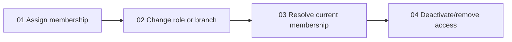
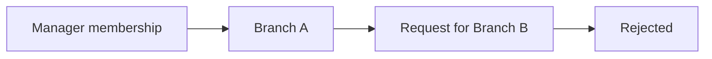

# Slice map: memberships and access

The most important proof is branch isolation:

This map uses Mermaid because it shows slice order and the security proof
quickly. The detailed slice document must still define the exact API contract,
file paths, invariants and tests in text and tables.

Detailed plan: [`../02_branch-access-control/SLICES.md`](../02_branch-access-control/SLICES.md).
