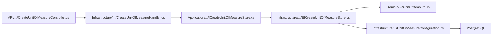

# Slice: Create unit of measure

## 0. Metadata

```text
Slice: CreateUnitOfMeasure
Technical operation: CreateUnitOfMeasure
Status: Implemented; PostgreSQL execution blocked locally
Branch: feature/catalog-management
Owner: Catalog module
Source documents: PF2 roadmap, PF2 stage README, PF2 slice index
```

This is the first PF2 slice because products cannot be created safely until
their unit-of-measure reference is explicit, scoped and protected by a
database constraint.

## 1. Business problem

ProcureFlow needs a consistent unit of measure for every catalog product. An
organization may need values such as `piece`, `kilogram`, `liter` or `hour`,
while different organizations may use different reference values.

This slice allows an authorized catalog manager to create one active unit of
measure. It does not convert quantities and does not create a product yet.

The slice is successful when the new unit belongs to the selected organization,
has a normalized name and symbol, cannot duplicate another active symbol in the
same organization, and is returned through the API without exposing a Domain
entity directly.

## 2. Verified facts, assumptions and decision gates

### Facts verified in the current repository

- `UnitOfMeasure` exists in the Domain project with normalization and audit
	fields, and its focused Domain tests pass.
- The `CreateUnitOfMeasure` Application, Infrastructure and API slice exists
	with focused handler and in-memory API tests.
- The catalog `DbSet`, EF configuration and generated migration exist. The
	PostgreSQL tests are prepared but Docker Engine is unavailable locally.
- No `PurchaseRequestItem` model currently exists; historical product snapshots
	belong to the future PF3 purchase-request module.
- Organization-scoped endpoints use the route shape
	`api/organizations/{organizationId:guid}/...`.
- The existing backend separates Domain state, Application contracts,
	Infrastructure handlers/stores and API HTTP mapping.
- Existing organization management uses `ApiResponse<T>` and maps application
	results to HTTP responses in controllers.
- Business roles are organization or branch scoped; they must not be added to
	the global platform role model.

### Decisions for this slice

| ID | Decision | Default for this slice | Owner or evidence |
| --- | --- | --- | --- |
| CAT-001 | Catalog scope | One organization; shared by all its branches; no `BranchId` | PF2 stage boundary |
| CAT-002 | Unit fields | Required `Name` and `Symbol`; generated `Id`; active state and audit fields | Domain and persistence design |
| CAT-003 | Normalization | Trim both fields; compare names and symbols case-insensitively; reject blank values | Domain validation and PostgreSQL index |
| CAT-004 | Active uniqueness | One active normalized symbol per organization | Partial unique PostgreSQL index and integration test |
| CAT-005 | Archived duplicates | An archived row may coexist with a new active row using the same symbol; reactivation returns `409` when it conflicts | Reference lifecycle policy |
| CAT-006 | Hard delete | No public hard-delete operation in the PF2 MVP; future deletion must respect restrictive foreign keys | PF2 lifecycle boundary |
| CAT-007 | Authorization | Procurement and global Admin may create; Employee and Manager may only read active values | PF2 permission matrix and current membership context |
| CAT-008 | Unit conversion | Out of scope; the unit is a product label, not a conversion engine | PF2 scope boundary |

If the product owner later chooses a global catalog rather than an
organization-scoped catalog, update CAT-001 before creating the entity or
migration. Do not implement both scopes at the same time.

## 3. Actor and resource scope

```text
Actor: authenticated Procurement member or global technical Admin
Resource: one UnitOfMeasure reference record
Organization scope: organizationId from the route; organization must be active
Branch scope: none; catalog data is shared by organization branches
Authentication required: Yes
Authorization rule: Procurement membership in the organization or existing Admin policy
```

The route organization is the only organization scope source. The request body
must not contain a second `organizationId` that could disagree with the route.
The handler/store must verify the organization from current database state and
must not trust a client-supplied membership claim as ownership evidence.

## 4. Preconditions

The operation may proceed only when:

- the caller is authenticated;
- the caller satisfies the Procurement or Admin authorization rule;
- the route organization exists and is active;
- `Name` is not blank after trimming;
- `Symbol` is not blank after trimming;
- the normalized symbol does not already belong to an active unit in the route
	organization.

An archived unit with the same symbol does not block creating a new active
unit. A second request racing with this operation must still be rejected by the
database unique index and mapped to `409 Conflict`.

## 5. Input and output contract

### Request

```text
HTTP method: POST
HTTP route: /api/organizations/{organizationId:guid}/catalog/units-of-measure
Route values: organizationId
Request body: name, symbol
Required fields: name, symbol
Optional fields: none
```

Recommended JSON shape:

```json
{
	"name": "Kilogram",
	"symbol": "kg"
}
```

The request validator performs shape and length validation. The Domain model
owns the valid state and normalization rule. Exact maximum lengths must follow
the repository convention after the nearest existing reference-data mapping is
confirmed; the initial plan should use `Name <= 100` and `Symbol <= 20` unless
that convention proves incompatible.

### Successful response

```text
Status: 201 Created
Body: ApiResponse<UnitOfMeasureResponse>
State changes: one new active UnitOfMeasure
Database writes: one row in UnitOfMeasures
```

The response may expose:

```json
{
	"id": "00000000-0000-0000-0000-000000000000",
	"organizationId": "00000000-0000-0000-0000-000000000000",
	"name": "Kilogram",
	"symbol": "kg",
	"isActive": true
}
```

The API owns `UnitOfMeasureResponse`. It must map from an Application view and
must not serialize the Domain entity directly.

### Failure response

| Situation | Application result | HTTP result |
| --- | --- | --- |
| No access token | Not handled by the handler | `401 Unauthorized` |
| Authenticated caller is not allowed to manage the catalog | Policy or authorization failure | `403 Forbidden` |
| Invalid route or body shape | Validation error | `400 Bad Request` |
| Organization does not exist, is archived or is outside caller scope | Not found or documented safe scope result | `404 Not Found` |
| Name or symbol is blank after normalization | Validation error | `400 Bad Request` |
| Active symbol already exists in the organization | Conflict | `409 Conflict` |
| Concurrent insert violates the active unique index | Classified PostgreSQL conflict | `409 Conflict` |

The Application layer returns an application result. It does not return
`IActionResult` or PostgreSQL-specific exceptions.

## 6. Invariants

| Invariant | Owner | Protection |
| --- | --- | --- |
| Unit has a non-empty normalized name | Domain | Entity factory and unit test |
| Unit has a non-empty normalized symbol | Domain | Entity factory and unit test |
| New unit starts active | Domain | Entity factory and handler test |
| Unit belongs to exactly one organization | Application and PostgreSQL | Route scope, command and required FK |
| Active symbols are unique within an organization | PostgreSQL plus application pre-check | Partial unique index and PostgreSQL integration test |
| Archived rows remain available for history | Persistence lifecycle | No hard-delete path in this MVP |
| Only Procurement or Admin can create a unit | API and application authorization | Authorization test and forbidden-request test |
| Branch identifiers cannot change catalog scope | API/application contract | No `BranchId` in request or entity |

The application duplicate check gives a useful normal error message. The
database constraint is still required because two requests can pass the check
before either transaction commits.

## 7. Simplified flow

```mermaid
flowchart LR
	Request["POST /api/organizations/{organizationId}/catalog/units-of-measure"]
		--> Api["API<br/>authentication + authorization<br/>route/body binding"]
	Api --> Command["CreateUnitOfMeasureCommand"]
	Command --> Handler["CreateUnitOfMeasureHandler<br/>organization scope + duplicate check"]
	Handler --> Domain["UnitOfMeasure<br/>normalize + valid state"]
	Domain --> Store["Focused store"]
	Store --> Database["EF Core / PostgreSQL<br/>FK + active unique index"]
	Database --> Result["Application result"]
	Result --> Response["UnitOfMeasureResponse<br/>201 or mapped failure"]
```



Important ownership decisions:

- API owns HTTP binding and authorization entry points.
- The handler coordinates organization scope and persistence outcomes.
- `UnitOfMeasure` owns its own state and normalization invariant.
- PostgreSQL owns final referential integrity and active-symbol uniqueness.

## 8. Existing code reconciliation

No catalog implementation exists yet. The following plan is therefore
explicitly `CREATE` or `MODIFY`, not a claim that these paths already exist.

| Path | Classification | Planned responsibility | Planned action |
| --- | --- | --- | --- |
| `backend/Domain/Models/Catalog/UnitOfMeasure.cs` | VERIFY | Unit state, normalization and active lifecycle | Existing focused Domain model validated; do not create a generic reference base class |
| `backend/Application/Modules/Catalog/UnitOfMeasure/CreateUnitOfMeasure/CreateUnitOfMeasureCommand.cs` | CREATE | Input command with organization scope, name and symbol | Add command; organization id comes from route mapping |
| `backend/Application/Modules/Catalog/UnitOfMeasure/CreateUnitOfMeasure/ICreateUnitOfMeasureHandler.cs` | CREATE | Application use-case port | Add focused handler contract |
| `backend/Application/Modules/Catalog/UnitOfMeasure/CreateUnitOfMeasure/ICreateUnitOfMeasureStore.cs` | CREATE | Organization lookup, duplicate lookup and persistence port | Keep it focused on this use case |
| `backend/Application/Modules/Catalog/UnitOfMeasure/UnitOfMeasureView.cs` | CREATE | Application output view | Keep the view outside the Domain model and map it in API |
| `backend/Infrastructure/Modules/Catalog/UnitOfMeasure/CreateUnitOfMeasure/CreateUnitOfMeasureHandler.cs` | CREATE | Cross-record checks, Domain creation and result mapping | Implement concrete handler in Infrastructure |
| `backend/Infrastructure/Modules/Catalog/UnitOfMeasure/CreateUnitOfMeasure/EfCreateUnitOfMeasureStore.cs` | CREATE | EF Core queries and persistence | Use organization-scoped queries and no HTTP types |
| `backend/Infrastructure/Data/Configurations/Catalog/UnitOfMeasureConfiguration.cs` | CREATE | Table, columns, FK and indexes | Map explicit lengths, UTC audit fields and active uniqueness |
| `backend/Infrastructure/Data/ApplicationDbContext.cs` | MODIFY | DbSet and model discovery if required | Add `DbSet<UnitOfMeasure>` only if it matches the current context convention |
| `backend/Infrastructure/Modules/Catalog/CatalogModule.cs` | CREATE | Module DI registrations | Register handler and store; API composition root calls `AddCatalogModule` |
| `backend/API/Modules/Catalog/UnitOfMeasure/CreateUnitOfMeasure/CreateUnitOfMeasureRequest.cs` | CREATE | HTTP request contract | Keep route organization out of the body |
| `backend/API/Modules/Catalog/UnitOfMeasure/CreateUnitOfMeasure/CreateUnitOfMeasureValidator.cs` | CREATE | Request shape validation | Reuse current validation convention |
| `backend/API/Modules/Catalog/UnitOfMeasure/CreateUnitOfMeasure/CreateUnitOfMeasureController.cs` | CREATE | Route, authorization and response mapping | Follow organization controller conventions |
| `backend/API/Modules/Catalog/UnitOfMeasure/UnitOfMeasureResponse.cs` | CREATE | API response DTO | Map from `UnitOfMeasureView` |
| `backend/Infrastructure/Data/Migrations/20260921114859_AddCatalogUnitOfMeasures.cs` | VERIFY | Schema change | Migration generated and inspected; PostgreSQL execution remains pending |
| `backend/UnitTests/Domain/Models/Catalog/UnitOfMeasureTests.cs` | VERIFY | Domain normalization and invalid-state tests | Focused Domain tests pass |
| `backend/UnitTests/Modules/Catalog/CreateUnitOfMeasure/CreateUnitOfMeasureHandlerTests.cs` | CREATE | Scope, duplicate and result tests | Six focused handler tests pass without HTTP |
| `backend/IntegrationTests/UnitOfMeasureApiInMemoryIntegrationTests.cs` | CREATE | Auth and API contract | Five in-memory API tests pass |
| `backend/IntegrationTests/UnitOfMeasurePostgreSqlIntegrationTests.cs` | CREATE | PostgreSQL uniqueness and concurrency | Tests are present; Testcontainers execution is blocked until Docker is running |
| `backend/IntegrationTests/ModuleArchitectureIntegrationTests.cs` | VERIFY | Module registration and route uniqueness | Extend only if the existing architecture tests cover new module surfaces |

Before implementation, inspect the nearest current organization controller,
module extension and audit-field mapping. If the repository uses a different
folder or naming convention, update this table before creating files.

## 9. File plan

```text
Domain:
		create UnitOfMeasure model and focused domain tests

Application:
		create command, result/view, handler port and focused store port

Infrastructure:
		create handler and EF store
		create EF configuration and module registration
		modify ApplicationDbContext only when required by the current convention
		generate and inspect the migration

API:
		create request, validator, response and controller
		map application outcomes to 201, 400, 401, 403, 404 and 409

Tests:
		domain unit tests
		handler tests
		API authorization and contract tests
		PostgreSQL FK, active uniqueness and concurrent-insert tests
```

Responsibility flow:



## 10. Test plan

### Cheapest proving test

```text
Create an active unit with symbol "kg" in Organization A.
Attempt another active unit with symbol " KG " in Organization A.
Expected: the second operation returns 409 and no second active row exists.
```

This test proves normalization, organization scope and active uniqueness in one
small behavior. The final version must run against PostgreSQL because the
partial unique index is part of the requirement.

### Behavior matrix

| Behavior | Test level | Expected proof |
| --- | --- | --- |
| Valid name and symbol | Domain plus handler | One active unit is created with normalized values |
| Blank name | Domain/API | Operation maps to `400`; no row is written |
| Blank symbol | Domain/API | Operation maps to `400`; no row is written |
| Trimming | Domain | Stored values do not contain accidental surrounding spaces |
| Case-insensitive duplicate | PostgreSQL integration | `kg` and `KG` cannot both be active in one organization |
| Same symbol in another organization | PostgreSQL integration | Separate organization scopes do not conflict |
| Archived duplicate followed by active create | PostgreSQL integration | New active row is allowed according to CAT-005 |
| Reactivation conflict | Handler/API integration | Conflict is returned when an archived row would duplicate an active row |
| Archived organization | Handler/API integration | Create is rejected; no row is written |
| Missing token | API integration | `401 Unauthorized` |
| Non-manager caller | API integration | `403 Forbidden` |
| Concurrent duplicate insert | PostgreSQL integration | One request succeeds and the other maps the unique violation to `409` |
| Foreign-key integrity | PostgreSQL integration | Unit cannot reference a missing organization |
| DI registration | Module architecture test | Handler and store resolve from the module registration |

## 11. Checkpoints

```text
Checkpoint 0: reconcile the plan with current organization conventions
		-> inspection only; confirm routes, authorization, module registration and audit fields

Checkpoint 1: create the Domain model and unit tests [completed]
		-> focused UnitTests for UnitOfMeasure pass

Checkpoint 2: add EF configuration and migration [completed; runtime validation pending]
		-> generated migration and model snapshot inspected
		-> focused PostgreSQL schema test awaits Docker Engine

Checkpoint 3: add Application and Infrastructure contracts/handler/store [completed]
		-> six focused handler tests pass

Checkpoint 4: add API request/response/controller and DI registration [completed]
		-> five in-memory authorization and contract tests pass

Checkpoint 5: prove PostgreSQL uniqueness and concurrency [pending locally]
		-> run UnitOfMeasurePostgreSqlIntegrationTests with Docker available

Checkpoint 6: add frontend reference-data controls when the product slice is ready
		-> run focused frontend tests and production build
```

Do not start the next checkpoint while the focused validation for the previous
checkpoint is red. Do not treat an in-memory test as proof of a PostgreSQL
unique index.

## 12. Definition of done

- [ ] The business result is stated without relying on class names.
- [ ] `UnitOfMeasure` is organization-scoped and has no `BranchId`.
- [ ] Name and symbol normalization is covered by Domain tests.
- [ ] Active-symbol uniqueness is protected by PostgreSQL.
- [ ] Application duplicate checks and database race handling return `409`.
- [ ] The API does not accept a duplicate organization scope in the body.
- [ ] Procurement and Admin authorization is enforced by the backend.
- [ ] The migration has been inspected and tested against PostgreSQL.
- [ ] DI registration and route uniqueness are verified.
- [ ] The user can explain why unit conversion is outside this slice.

## 13. Teach-back

1. Why is this operation named `CreateUnitOfMeasure` instead of a generic
	 `CreateCatalogItem`?
2. Which invariant belongs in the Domain model?
3. Why does the handler need organization scope in addition to request
	 validation?
4. Why is the active-symbol check not sufficient without a PostgreSQL index?
5. Why can the same symbol exist in two organizations?
6. What must PF3 snapshot when a product is added to a purchase-request draft?
7. Which files are created, and which existing files are only verified or
	 modified?