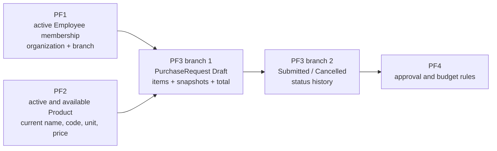
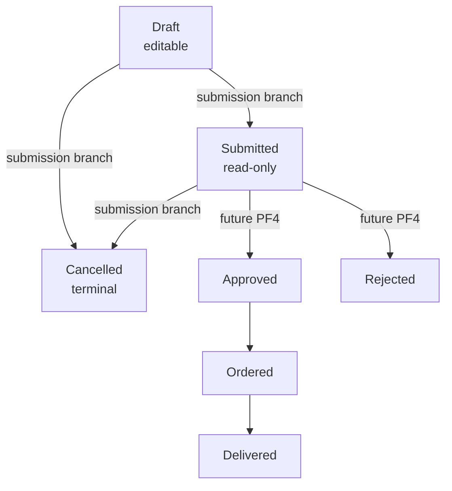

# Stage PF3: Purchase request core

- Status: Planned
- Branches: `feature/purchase-request-drafts`, then `feature/purchase-request-submission`
- Roadmap source: [PF3 Purchase request core](../../ROADMAP/PROCUREFLOW/04_PF3_PURCHASE_REQUEST_CORE.md)
- Product boundary: a branch-scoped purchase request owned by its employee author

## Purpose

PF3 introduces the first real ProcureFlow transaction aggregate. An Employee
can create a draft for the branch from the current active membership, add
catalog products, adjust quantities and remove items. The backend keeps the
historical product snapshot and calculates the authoritative total.

PF3 is deliberately split into two independently valid branches:

1. `feature/purchase-request-drafts` creates and edits the `Draft` aggregate.
2. `feature/purchase-request-submission` adds `Draft -> Submitted`, cancellation
   and status history.

The first branch must not implement submission, cancellation, approvals or a
status-history table. A draft is allowed to be temporarily empty because the
completeness rule belongs to submission.

## Prerequisites

PF3 depends on the following behavior being available and tested:

- PF1 resolves an active organization membership with `Employee`, `Manager` or
  `Procurement` business scope and an optional branch.
- An Employee membership has a non-null active branch.
- PF2 exposes an organization-scoped product read contract that can select only
  products that are active and available for a new draft.
- The existing API maps application outcomes to HTTP and the existing EF Core
  model uses string `ConcurrencyStamp` values as concurrency tokens.

The current repository contains the membership and unit-of-measure foundations,
but no `PurchaseRequest`, product entity, request API or purchase-request
frontend yet. The implementation plan therefore marks those paths as `CREATE`
and keeps the existing foundations as `REUSE` or `VERIFY`.

## Product flow



The arrows describe data dependencies, not direct Domain references. The
purchase-request handler asks a focused catalog port for a selectable product,
then copies the values needed for request history into its own item.

## Aggregate boundary

`PurchaseRequest` is a new aggregate. It is not a rename of `Project` or
`ProjectTask`.

| Responsibility | Owner |
| --- | --- |
| Request status and draft editability | `PurchaseRequest` aggregate |
| Item collection and one-product-one-line rule | `PurchaseRequest` aggregate |
| Positive quantity and quantity limit | `PurchaseRequestItem` plus aggregate method |
| Product name, code, unit and price at selection time | `PurchaseRequestItem` snapshot |
| Total calculation | `PurchaseRequest` aggregate/backend |
| Current author, organization and branch access | Application handler and focused store |
| Active/available product lookup | Catalog read port and handler |
| Foreign keys, unique item identity and concurrency token | EF Core/PostgreSQL |
| HTTP status codes and response DTOs | API layer |

The aggregate must be changed through methods such as `AddItem`,
`UpdateItemQuantity` and `RemoveItem`. Infrastructure must not mutate the item
collection directly to bypass the invariant.

## Scope and access model

```text
Actor: authenticated Employee
Resource: PurchaseRequest owned by the current user
Organization scope: organizationId route value, matched with current membership
Branch scope: BranchId captured from the active Employee membership at creation
Authentication: required
Authorization: active Employee membership in the same organization and branch;
               only the author may read or mutate a draft
```

The client never supplies `AuthorUserId`, `BranchId`, `Status`,
`UnitPriceSnapshot` or `TotalValue`. The handler derives or reads them from
trusted server state. A caller outside the request scope receives the existing
safe not-found behavior for resource reads; a caller that lacks the required
business permission receives the mapped forbidden result where the endpoint
can safely distinguish it.

The recommended MVP rule is to require the author's active Employee
membership in the stored organization and branch for later draft mutations.
If membership changes, an explicit future transfer operation is needed; PF3
must not silently move a request to another branch.

## Data model decision

### `PurchaseRequest`

The aggregate stores at least:

- `Id`;
- `OrganizationId`;
- `BranchId`;
- `AuthorUserId`;
- `Status`;
- optional normalized request note;
- derived `TotalValue`;
- `ConcurrencyStamp`;
- `CreatedAt` and `UpdatedAt`;
- owned `PurchaseRequestItem` collection.

### `PurchaseRequestItem`

Each line stores at least:

- `Id` and `PurchaseRequestId`;
- `ProductId` as the catalog identity used for selection;
- `ProductNameSnapshot`;
- optional `ProductCodeSnapshot`;
- `UnitOfMeasureSnapshot`;
- `UnitPriceSnapshot`;
- positive `Quantity`;
- optional normalized item comment.

The first implementation should use `decimal` quantity with an explicit
PostgreSQL precision and a documented maximum. The recommended initial gate is
`numeric(12,3)` with `0 < Quantity <= 1,000,000`; the product owner must confirm
that limit before the migration is generated. Unit prices and total values are
money values with explicit two-decimal persistence and calculation rules.

### Status lifecycle

The drafts branch creates only `Draft` records and allows edits only while the
aggregate is in `Draft`. The submission branch owns transitions and history:



The enum may describe the product lifecycle, but the drafts branch must not
add transition commands or status-history persistence for states outside its
scope.

## Planned API surface

The following route shape keeps organization scope explicit while deriving the
branch from the current membership. It is a design contract for the branch;
the nearest existing controller convention must be checked before coding.

| Use case | Method and route | Success |
| --- | --- | --- |
| Create draft | `POST /api/organizations/{organizationId}/purchase-requests` | `201 Created` |
| List own requests | `GET /api/organizations/{organizationId}/purchase-requests/mine` | `200 OK` |
| Get own draft details | `GET /api/organizations/{organizationId}/purchase-requests/{purchaseRequestId}` | `200 OK` |
| Add item | `POST /api/organizations/{organizationId}/purchase-requests/{purchaseRequestId}/items` | `200 OK` |
| Update item quantity | `PUT /api/organizations/{organizationId}/purchase-requests/{purchaseRequestId}/items/{itemId}` | `200 OK` |
| Remove item | `DELETE /api/organizations/{organizationId}/purchase-requests/{purchaseRequestId}/items/{itemId}` | `200 OK` |

Mutation bodies include `concurrencyStamp` except creation. The add-item body
contains only `productId`, `quantity` and an optional comment. The update body
contains only `quantity` and `concurrencyStamp`; the remove operation carries
the expected stamp in its body or query according to the existing endpoint
convention. None of these contracts accepts an authoritative price or total.

## Shared failure mapping

Application handlers return a purchase-request result independent of HTTP. The
API maps its status to the repository's response wrapper:

| Application outcome | HTTP |
| --- | --- |
| Validation error | `400 Bad Request` |
| Missing or out-of-scope request/product | `404 Not Found` |
| Missing business permission | `403 Forbidden` |
| Stale `ConcurrencyStamp`, duplicate product line or invalid state conflict | `409 Conflict` |
| Unexpected failure | `500 Internal Server Error` |

A stale version must not be converted into a generic validation error. The
client needs `409` to offer a refresh/retry path without overwriting newer
server state.

## Branch documentation

The first branch is documented as an independently valid vertical slice:

- [Draft slices](purchase-request-drafts/SLICES.md)
- [Draft file plan](purchase-request-drafts/FILE_PLAN.md)
- [Draft test plan](purchase-request-drafts/TEST_PLAN.md)
- [Draft decision gates](purchase-request-drafts/OPEN_QUESTIONS.md)

The later submission branch should extend this stage with its own slice index.
It must reuse the aggregate and status enum without moving submission rules into
the draft commands.

## Out of scope for PF3

- approval and rejection decisions;
- budget reservation or branch budget limits;
- procurement fulfillment, stock or warehouse state;
- recurring requests and file import;
- attachments owned by `PurchaseRequest`;
- configurable workflows;
- editing a request after submission;
- renaming or removing the existing `Projects` and `ProjectTasks` domain.

## Stage definition of done

### Draft branch

- [ ] `PurchaseRequest` and `PurchaseRequestItem` are separate new Domain models.
- [ ] Draft access is restricted to the author's current organization and branch.
- [ ] Product selection copies the agreed historical snapshot.
- [ ] The aggregate owns item uniqueness, quantity validation and total calculation.
- [ ] Every draft mutation requires the expected `ConcurrencyStamp`.
- [ ] PostgreSQL protects foreign keys, item uniqueness and concurrency behavior.
- [ ] API results remain HTTP-independent until the API mapping boundary.
- [ ] Draft list, details and item editing work through the frontend.

### Submission branch

- [ ] `Draft -> Submitted` and cancellation are explicit aggregate transitions.
- [ ] Empty requests cannot be submitted.
- [ ] Status and first history event are persisted atomically.
- [ ] Submitted requests are read-only through the draft UI.

## Teach-back questions

1. Which rules can `PurchaseRequest` enforce without reading the database?
2. Why is `BranchId` derived from membership instead of accepted from the request body?
3. Why does an item keep a product snapshot when it still stores `ProductId`?
4. What is the difference between an application conflict and an HTTP `409`?
5. Why is an empty draft allowed in branch one but rejected by submission?
