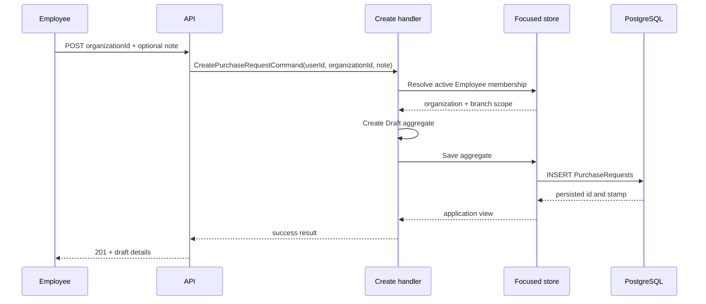

# Slice: Create purchase request

## 0. Metadata

```text
Slice: CreatePurchaseRequest
Technical operation: CreatePurchaseRequest
Status: Planned
Branch: feature/purchase-request-drafts
Owner: PurchaseRequests module
Source documents: PF3 roadmap, PF3 stage README, PF3 draft slice index
```

## 1. Business problem

An Employee needs a safe starting point for a purchase request without choosing
an arbitrary organization or branch from the client. Without this slice, later
item operations cannot establish the request owner, scope or optimistic
concurrency boundary.

This slice is successful when an authorized Employee receives an empty `Draft`
whose organization, branch and author were derived from current membership.

## 2. Actor and resource scope

```text
Actor: authenticated Employee with an active branch membership
Resource: one new PurchaseRequest aggregate
Organization scope: organizationId from the route, matched to current membership
Branch scope: active branch from the current membership
Authentication required: Yes
Authorization rule: only Employee may create through this flow
```

The request body must not contain `AuthorUserId`, `BranchId` or `Status`.

## 3. Preconditions

- the caller is authenticated and maps to a valid user id;
- the route organization exists and is active;
- the caller has an active Employee membership in that organization;
- the membership has an active branch;
- the optional note is within the agreed limit after trimming.

## 4. Input and output contract

### Request

```text
HTTP method: POST
HTTP route: /api/organizations/{organizationId:guid}/purchase-requests
Request body: { note?: string }
Required fields: none
Optional fields: note
Validation rules: trim note; blank note becomes null; enforce PRD-003 length
```

### Successful response

```text
Status: 201 Created
Body: ApiResponse<PurchaseRequestDetailsResponse>
State changes: one empty Draft aggregate
Database writes: one PurchaseRequests row with zero total and a new stamp
```

The response includes the request id, organization, branch, author, `Draft`,
empty items, zero total, timestamps and the initial `ConcurrencyStamp`.

### Failure response

| Situation | Application result | HTTP result |
| --- | --- | --- |
| Invalid authentication claim | Not handled by handler | `401` |
| Caller is not an Employee in the organization | Forbidden | `403` |
| Organization is missing or archived | Not found or conflict by repository convention | `404` or `409` |
| Note is invalid or too long | Validation error | `400` |

## 5. Invariants

| Invariant | Owner | Protection |
| --- | --- | --- |
| Organization, branch and author ids are non-empty | Domain | Aggregate factory and unit test |
| Request belongs to the active membership branch | Application/store | Scoped membership lookup and handler test |
| New request starts as `Draft` | Domain | Factory and unit test |
| New request has zero total and no items | Domain | Factory and handler test |
| New request has a non-empty concurrency stamp | Domain/persistence | Factory and EF mapping |
| Client cannot choose scope or status | API/application | Request DTO excludes fields; API test |

## 6. Simplified flow



The handler coordinates membership and persistence; the aggregate owns its
initial valid state; the API owns HTTP mapping.

## 7. Existing code reconciliation

| Path | Classification | Current responsibility | Planned action |
| --- | --- | --- | --- |
| `backend/Domain/Models/Organizations/Membership.cs` | REUSE | Role, branch and active membership state | Use as the access source; do not duplicate it |
| `backend/Infrastructure/Data/Configurations/Organization/Membership/OrganizationMembershipConfiguration.cs` | VERIFY | Membership FKs and active uniqueness | Confirm scoped membership query support |
| `backend/Domain/Entities/PurchaseRequest.cs` | CREATE | New aggregate | Add factory, note normalization, Draft state and stamp |
| `backend/Application/Modules/PurchaseRequests/CreatePurchaseRequest/` | CREATE | Command, handler port and store port | Add focused contract |
| `backend/Infrastructure/Modules/PurchaseRequests/CreatePurchaseRequest/` | CREATE | Membership lookup and persistence | Implement handler/store without HTTP types |
| `backend/API/Modules/PurchaseRequests/CreatePurchaseRequest/` | CREATE | Route, validator and response mapping | Add organization-scoped endpoint |
| `backend/Infrastructure/Data/ApplicationDbContext.cs` | MODIFY | EF DbSets | Register new aggregate set |

## 8. File plan

```text
Domain:
    backend/Domain/Entities/PurchaseRequest.cs
    backend/Domain/Enums/PurchaseRequestStatus.cs

Application:
    CreatePurchaseRequestCommand.cs
    ICreatePurchaseRequestHandler.cs
    ICreatePurchaseRequestStore.cs
    PurchaseRequestOperationResult.cs and view contract

Infrastructure:
    CreatePurchaseRequestHandler.cs
    EfCreatePurchaseRequestStore.cs
    PurchaseRequestConfiguration.cs
    PurchaseRequestsModule.cs

API:
    CreatePurchaseRequestRequest.cs
    CreatePurchaseRequestValidator.cs
    CreatePurchaseRequestController.cs
    PurchaseRequestResponses.cs

Tests:
    PurchaseRequestTests.cs
    CreatePurchaseRequestHandlerTests.cs
    PurchaseRequestsApiInMemoryIntegrationTests.cs
```

## 9. Test plan

### Cheapest proving test

Create an active Employee membership for Branch A and call the endpoint with
organization A. Assert `201`, `Draft`, empty items and stored Branch A. Repeat
with a Manager or a membership from another organization and assert rejection.

### Behavior matrix

| Behavior | Test | Expected proof |
| --- | --- | --- |
| Valid Employee creates draft | Handler/API | One scoped Draft is returned |
| Employee has no branch | Handler/API | Operation is rejected; no row |
| Non-Employee caller | API | `403` and no row |
| Archived organization | Handler/API | No draft is written |
| Client sends branch/author/status fields | API | Fields are ignored/rejected; trusted scope wins |
| Initial stamp and total | Domain/PostgreSQL | Non-empty stamp and zero total |

## 10. Checkpoints

```text
Checkpoint 0: confirm membership and controller conventions
    -> inspection only
Checkpoint 1: aggregate factory and domain tests
    -> focused PurchaseRequest unit tests
Checkpoint 2: EF mapping and migration
    -> PostgreSQL create/read test
Checkpoint 3: handler and API contract
    -> focused in-memory authorization test
Checkpoint 4: regression validation
    -> backend build and existing tests
```
