# Slice: Add purchase-request item

## 0. Metadata

```text
Slice: AddPurchaseRequestItem
Technical operation: AddPurchaseRequestItem
Status: Planned
Branch: feature/purchase-request-drafts
Owner: PurchaseRequests module
Source documents: PF3 roadmap, PF3 stage README, PF3 draft slice index
```

## 1. Business problem

An Employee needs to select a catalog product for an own draft. The request
must remember what was selected even if the catalog product is renamed,
archived or repriced later. Without this slice, request history would depend on
mutable catalog data and the client could forge the authoritative amount.

This slice is successful when one active and available product becomes one
request line with a server-owned snapshot and a recalculated total.

## 2. Actor and resource scope

```text
Actor: authenticated Employee who authored the request
Resource: one item inside an own Draft
Organization scope: request organization and current membership organization
Branch scope: request stored branch and current Employee membership branch
Authentication required: Yes
Authorization rule: author only; request must still be Draft
```

## 3. Preconditions

- the caller has an active Employee membership in the request organization and
  stored branch;
- the request exists, belongs to the caller and is `Draft`;
- the product exists in the same organization;
- the product is active and available for new request selection;
- quantity is positive and within the agreed maximum;
- no existing item in the request has the same `ProductId`;
- optional comment satisfies the text limit;
- the expected request `ConcurrencyStamp` is present.

## 4. Input and output contract

### Request

```text
HTTP method: POST
HTTP route: /api/organizations/{organizationId:guid}/purchase-requests/{purchaseRequestId:guid}/items
Request body: { productId, quantity, comment?, concurrencyStamp }
Required fields: productId, quantity, concurrencyStamp
Optional fields: comment
Rejected fields: product name, product code, unit, unit price, total, status
```

### Successful response

```text
Status: 200 OK
Body: ApiResponse<PurchaseRequestDetailsResponse>
State changes: one item is appended and request total/stamp are changed
Database writes: PurchaseRequest and PurchaseRequestItem in one unit of work
```

The handler reads a focused catalog selection view and supplies the snapshot to
the aggregate. The client never supplies the snapshot values.

### Failure response

| Situation | Application result | HTTP result |
| --- | --- | --- |
| Request is missing or outside author scope | Not found | `404` |
| Caller lacks current Employee branch access | Forbidden or safe not-found | `403` or `404` |
| Request is not Draft | Conflict | `409` |
| Product is missing, archived or unavailable | Not found or conflict by catalog convention | `404` or `409` |
| Quantity/comment/stamp is invalid | Validation error | `400` |
| Product already has a line | Conflict | `409` |
| Expected stamp is stale | Conflict | `409` |

## 5. Invariants

| Invariant | Owner | Protection |
| --- | --- | --- |
| Only an own Draft can receive an item | Application + Domain | Scoped aggregate load and mutation guard |
| Product belongs to the request organization | Application/store | Focused catalog query |
| Only active/available products can be selected | Catalog handler/store | PF2 selection contract and integration test |
| Product occurs at most once per request | Aggregate + PostgreSQL | Duplicate check and unique index |
| Item snapshot is server-owned | Handler/API | Product read before aggregate call; request DTO excludes snapshot |
| Quantity is positive and bounded | Domain + PostgreSQL | Item factory/check constraint |
| Total equals sum of line values | Domain | Recalculate in aggregate and unit test |
| Successful add changes the request stamp | Domain/EF | Touch method and concurrency mapping |

## 6. Simplified flow

```mermaid
flowchart LR
    Request["POST item<br/>productId + quantity + stamp"] --> Api["API<br/>binding + auth"]
    Api --> Handler["Add handler<br/>scope + product selection"]
    Handler --> Catalog["PF2 focused product read<br/>active + available"]
    Catalog --> Snapshot["server-owned snapshot"]
    Snapshot --> Aggregate["PurchaseRequest<br/>AddItem + recalculate"]
    Aggregate --> Store["EF store"]
    Store --> Database["PostgreSQL<br/>unique item + concurrency"]
    Database --> Response["updated details / 409"]
```



The product lookup and request load are cross-resource concerns. Item
uniqueness, quantity and total are aggregate concerns.

## 7. Existing code reconciliation

| Path | Classification | Current responsibility | Planned action |
| --- | --- | --- | --- |
| `backend/Domain/Models/Catalog/UnitOfMeasure.cs` | REUSE | Existing catalog reference model | Do not attach it to the request item; use the PF2 product view |
| PF2 product read contract | VERIFY | Product identity/lifecycle/price | Confirm exact field names before creating the snapshot view |
| `backend/Domain/Entities/PurchaseRequest.cs` | CREATE | Aggregate item ownership | Add `AddItem` and total calculation |
| `backend/Domain/Entities/PurchaseRequestItem.cs` | CREATE | Snapshot and quantity state | Add immutable snapshot construction |
| `backend/Application/Modules/PurchaseRequests/AddPurchaseRequestItem/` | CREATE | Command, product view and focused store port | Add client-minimal command |
| `backend/Infrastructure/Modules/PurchaseRequests/AddPurchaseRequestItem/` | CREATE | Scoped request/product lookup and save | Map catalog data to snapshot; catch conflicts |
| `backend/API/Modules/PurchaseRequests/AddPurchaseRequestItem/` | CREATE | Nested route and request validation | Reject client-owned fields |

## 8. File plan

```text
Domain:
    PurchaseRequest.AddItem(...)
    PurchaseRequestItem.cs

Application:
    AddPurchaseRequestItemCommand.cs
    IAddPurchaseRequestItemHandler.cs
    IAddPurchaseRequestItemStore.cs
    SelectableProductView.cs

Infrastructure:
    AddPurchaseRequestItemHandler.cs
    EfAddPurchaseRequestItemStore.cs
    PurchaseRequestItemConfiguration.cs

API:
    AddPurchaseRequestItemRequest.cs
    AddPurchaseRequestItemValidator.cs
    AddPurchaseRequestItemController.cs

Tests:
    PurchaseRequestTests.cs and PurchaseRequestItemTests.cs
    AddPurchaseRequestItemHandlerTests.cs
    snapshot/duplicate/PostgreSQL integration tests
```

## 9. Test plan

### Cheapest proving test

Add Product P at price 10.00 with quantity 2, then change the catalog price to
20.00. Assert the request item still contains price 10.00 and total 20.00.
This test disproves accidental live joins and client-owned pricing.

### Behavior matrix

| Behavior | Test | Expected proof |
| --- | --- | --- |
| Active product can be added | Handler/API | One snapshot line and correct total |
| Archived/unavailable product | Handler/API | No item is persisted |
| Product from another organization | Handler/PostgreSQL | Selection is rejected |
| Duplicate product | Domain/PostgreSQL | `409`; no second line |
| Client sends price/total | API/PostgreSQL | Catalog price and aggregate total win |
| Invalid quantity | Domain/API | `400`; no mutation |
| Stale stamp | PostgreSQL | `409`; request remains unchanged |
| Catalog changes later | PostgreSQL/API | Stored snapshot remains unchanged |

## 10. Checkpoints

```text
Checkpoint 0: freeze PF2 product selection contract
    -> contract inspection
Checkpoint 1: item snapshot and aggregate add method
    -> Domain unit tests
Checkpoint 2: unique index and precision mapping
    -> PostgreSQL duplicate/precision tests
Checkpoint 3: handler and API
    -> focused add-item integration test
Checkpoint 4: frontend selection
    -> API client and component test
```
