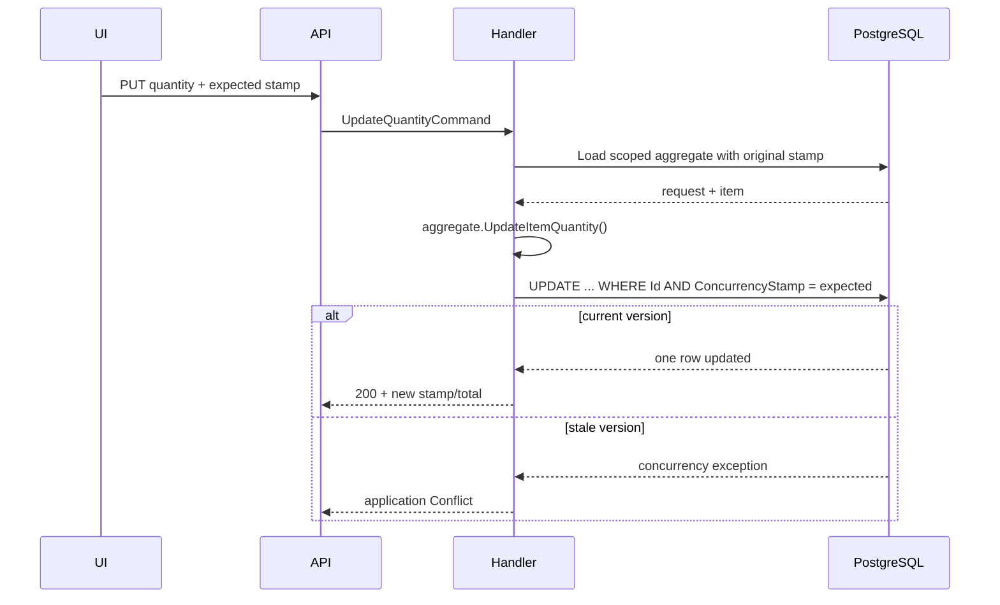

# Slice: Update purchase-request item quantity

## 0. Metadata

```text
Slice: UpdatePurchaseRequestItemQuantity
Technical operation: UpdatePurchaseRequestItemQuantity
Status: Planned
Branch: feature/purchase-request-drafts
Owner: PurchaseRequests module
Source documents: PF3 roadmap, PF3 stage README, PF3 draft slice index
```

## 1. Business problem

An Employee must be able to correct the quantity of an item already selected.
The update must preserve the product snapshot and must not overwrite another
browser's newer draft edit. Without this slice, users either remove and recreate
items or lose changes through last-write-wins behavior.

This slice is successful when a valid quantity changes only the selected line,
recalculates the total and requires the current aggregate version.

## 2. Actor and resource scope

```text
Actor: authenticated author with active Employee access to the request branch
Resource: one item inside an own Draft
Organization scope: request organization
Branch scope: request stored branch
Authentication required: Yes
Authorization rule: author only; request must be Draft
```

## 3. Preconditions

- the request and item exist in the caller's scope;
- the request is still `Draft`;
- expected `ConcurrencyStamp` is non-empty and matches the loaded request;
- quantity is positive and within the documented limit.

No current catalog price lookup is needed. The item snapshot is historical and
must remain unchanged.

## 4. Input and output contract

### Request

```text
HTTP method: PUT
HTTP route: /api/organizations/{organizationId:guid}/purchase-requests/{purchaseRequestId:guid}/items/{itemId:guid}
Request body: { quantity, concurrencyStamp }
Required fields: quantity, concurrencyStamp
Rejected fields: productId, snapshots, unit price, total, status
```

### Successful response

```text
Status: 200 OK
Body: ApiResponse<PurchaseRequestDetailsResponse>
State changes: selected quantity, derived total and request stamp
Database writes: one aggregate update and owned item update
```

### Failure response

| Situation | Application result | HTTP result |
| --- | --- | --- |
| Request/item is outside scope | Not found | `404` |
| Caller lacks current author access | Forbidden or safe not-found | `403` or `404` |
| Request is not Draft | Conflict | `409` |
| Quantity is invalid | Validation error | `400` |
| Stamp is missing or stale | Conflict or validation error | `409` or `400`; stale must be `409` |

## 5. Invariants

| Invariant | Owner | Protection |
| --- | --- | --- |
| Quantity stays positive and bounded | Item Domain model | `UpdateQuantity` and unit test |
| Product and all snapshots remain unchanged | Aggregate method | No product fields in command |
| Total reflects the new quantity | Aggregate | Recalculation after mutation |
| Only a Draft can be edited | Aggregate | Mutation guard |
| Every successful update changes the stamp | Aggregate | Touch method and unit test |
| Stale writers cannot overwrite current data | EF/PostgreSQL | Concurrency token and integration test |

## 6. Simplified flow



The pre-check gives a useful local error; the database condition is the final
protection when two contexts race.

## 7. Existing code reconciliation

| Path | Classification | Current responsibility | Planned action |
| --- | --- | --- | --- |
| `backend/Domain/Entities/Project.cs` | REUSE AS PATTERN | Existing `Touch`/stamp mutation pattern | Copy the idea, not the Project model or API contract |
| `backend/Infrastructure/Data/Configurations/ProjectConfiguration.cs` | REUSE AS PATTERN | EF concurrency-token mapping | Apply the same `IsConcurrencyToken` concept to requests |
| `backend/Domain/Entities/PurchaseRequest.cs` | CREATE | Aggregate mutation boundary | Add `UpdateItemQuantity` and stamp refresh |
| `backend/Application/Modules/PurchaseRequests/UpdatePurchaseRequestItemQuantity/` | CREATE | Command, handler and focused store port | Require `ExpectedConcurrencyStamp` |
| `backend/Infrastructure/Modules/PurchaseRequests/UpdatePurchaseRequestItemQuantity/` | CREATE | Load, mutate, save and classify concurrency | Catch `DbUpdateConcurrencyException` |
| `backend/API/Modules/PurchaseRequests/UpdatePurchaseRequestItemQuantity/` | CREATE | Nested route and validation | Require quantity and stamp |

## 8. File plan

```text
Domain:
    PurchaseRequest.UpdateItemQuantity(...)
    PurchaseRequestItem.UpdateQuantity(...)

Application:
    UpdatePurchaseRequestItemQuantityCommand.cs
    IUpdatePurchaseRequestItemQuantityHandler.cs
    IUpdatePurchaseRequestItemQuantityStore.cs

Infrastructure:
    UpdatePurchaseRequestItemQuantityHandler.cs
    EfUpdatePurchaseRequestItemQuantityStore.cs

API:
    UpdatePurchaseRequestItemQuantityRequest.cs
    UpdatePurchaseRequestItemQuantityValidator.cs
    UpdatePurchaseRequestItemQuantityController.cs

Tests:
    domain quantity-boundary tests
    handler stale/missing-stamp tests
    PostgreSQL two-context concurrency test
```

## 9. Test plan

### Cheapest proving test

Load the same draft through two EF contexts. Update it from context A, then send
context B's old stamp. Assert one success, one `409`, and the persisted quantity
and total equal context A's values.

### Behavior matrix

| Behavior | Test | Expected proof |
| --- | --- | --- |
| Valid quantity | Domain/API | Quantity and total update |
| Zero, negative or over-limit quantity | Domain/API | `400`; no invalid state |
| Snapshot fields are preserved | Domain | Product name/unit/price unchanged |
| Missing stamp | Handler/API | Mutation is rejected |
| Stale stamp | PostgreSQL | `409`; newer data survives |
| Non-author/other branch | API/PostgreSQL | No resource data is exposed |
| Submitted/non-draft state | Domain/handler | Mutation is rejected; transition is owned by later branch |

## 10. Checkpoints

```text
Checkpoint 0: confirm concurrency-token mapping convention
    -> inspect existing Project/ProjectTask update tests
Checkpoint 1: quantity method and tests
    -> focused Domain tests
Checkpoint 2: handler pre-check and conflict mapping
    -> focused handler tests
Checkpoint 3: PostgreSQL update race
    -> two-context integration test
Checkpoint 4: API and UI quantity editor
    -> API/frontend tests
```
