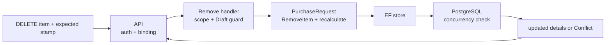

# Slice: Remove purchase-request item

## 0. Metadata

```text
Slice: RemovePurchaseRequestItem
Technical operation: RemovePurchaseRequestItem
Status: Planned
Branch: feature/purchase-request-drafts
Owner: PurchaseRequests module
Source documents: PF3 roadmap, PF3 stage README, PF3 draft slice index
```

## 1. Business problem

An Employee needs to remove a product that is no longer required. The draft
must remain editable even when the last line is removed; submission, not item
removal, owns the non-empty request rule.

This slice is successful when the author can remove one existing line with the
current version, the total is recalculated and an empty Draft remains valid.

## 2. Actor and resource scope

```text
Actor: authenticated author with active Employee access to the request branch
Resource: one item inside an own Draft
Organization scope: request organization
Branch scope: request stored branch
Authentication required: Yes
Authorization rule: author only; request must be Draft
```

## 3. Preconditions

- the request and item exist in the caller's scope;
- the request is `Draft`;
- the expected request `ConcurrencyStamp` is present and current;
- the item belongs to the route request id.

The catalog product does not need to be active for removal because the request
already owns the historical item snapshot.

## 4. Input and output contract

### Request

```text
HTTP method: DELETE
HTTP route: /api/organizations/{organizationId:guid}/purchase-requests/{purchaseRequestId:guid}/items/{itemId:guid}
Request body or query: concurrencyStamp, following the existing DELETE convention
Required fields: concurrencyStamp
```

### Successful response

```text
Status: 200 OK
Body: ApiResponse<PurchaseRequestDetailsResponse>
State changes: selected item is removed; total and request stamp are changed
Database writes: one aggregate/item delete unit of work
```

A draft with no remaining items is a valid response from this branch.

### Failure response

| Situation | Application result | HTTP result |
| --- | --- | --- |
| Request/item is missing or outside scope | Not found | `404` |
| Caller lacks current author access | Forbidden or safe not-found | `403` or `404` |
| Request is not Draft | Conflict | `409` |
| Stamp is missing | Validation error | `400` |
| Stamp is stale | Conflict | `409` |

## 5. Invariants

| Invariant | Owner | Protection |
| --- | --- | --- |
| Only an own Draft can lose an item | Application + Domain | Scoped load and mutation guard |
| Removed item no longer belongs to the aggregate | Domain/EF | Aggregate collection and relationship mapping |
| Remaining items stay unique | Domain/PostgreSQL | Existing invariant and unique index |
| Total equals remaining lines | Domain | Recalculation after removal |
| Empty Draft is allowed | Aggregate lifecycle boundary | No minimum-item rule in this branch |
| Successful removal changes the stamp | Domain/EF | Touch method and test |
| Stale writers cannot delete newer data | PostgreSQL | Concurrency token and integration test |

## 6. Simplified flow



The empty-draft result is intentional. The next branch will reject it only when
an Employee attempts submission.

## 7. Existing code reconciliation

| Path | Classification | Current responsibility | Planned action |
| --- | --- | --- | --- |
| `backend/Domain/Entities/PurchaseRequest.cs` | CREATE | Own item collection and total | Add `RemoveItem` without a minimum-item rule |
| `backend/Application/Modules/PurchaseRequests/RemovePurchaseRequestItem/` | CREATE | Command, handler and focused store port | Carry expected stamp explicitly |
| `backend/Infrastructure/Modules/PurchaseRequests/RemovePurchaseRequestItem/` | CREATE | Scoped load, aggregate call and save | Map EF concurrency exception to application conflict |
| `backend/API/Modules/PurchaseRequests/RemovePurchaseRequestItem/` | CREATE | DELETE route and response mapping | Follow current DELETE parameter convention |
| `backend/IntegrationTests/ProjectTasksApiIntegrationTests.cs` | REUSE AS PATTERN | Existing delete + concurrency API shape | Use as a reference only; do not couple PurchaseRequests to ProjectTasks |

## 8. File plan

```text
Domain:
    PurchaseRequest.RemoveItem(...)

Application:
    RemovePurchaseRequestItemCommand.cs
    IRemovePurchaseRequestItemHandler.cs
    IRemovePurchaseRequestItemStore.cs

Infrastructure:
    RemovePurchaseRequestItemHandler.cs
    EfRemovePurchaseRequestItemStore.cs

API:
    RemovePurchaseRequestItemController.cs
    request/route validator according to DELETE convention

Tests:
    aggregate empty-draft test
    handler scope and stale-stamp tests
    API and PostgreSQL delete tests
```

## 9. Test plan

### Cheapest proving test

Create a draft with one line, remove it using the current stamp and assert the
request remains `Draft`, contains zero items, has total zero and exposes a new
stamp.

### Behavior matrix

| Behavior | Test | Expected proof |
| --- | --- | --- |
| Remove existing line | Domain/API | Line disappears and total is recalculated |
| Remove last line | Domain/API | Empty Draft is valid |
| Missing item | API | `404`; no unrelated request data |
| Other author/branch | API/PostgreSQL | Operation cannot affect the request |
| Missing stamp | API/handler | Mutation is rejected |
| Stale stamp | PostgreSQL | `409`; item remains when another update won |
| Non-draft request | Domain/handler | Removal is rejected |

## 10. Checkpoints

```text
Checkpoint 0: confirm DELETE concurrency parameter convention
    -> inspect existing ProjectTask delete endpoint
Checkpoint 1: aggregate removal and empty-draft tests
    -> focused Domain tests
Checkpoint 2: handler and API
    -> scoped delete integration test
Checkpoint 3: PostgreSQL stale-delete race
    -> two-context test
Checkpoint 4: frontend remove action
    -> focused page test
```
