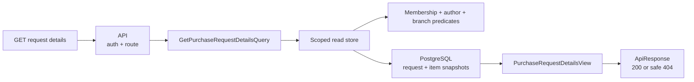

# Slice: Get purchase-request details

## 0. Metadata

```text
Slice: GetPurchaseRequestDetails
Technical operation: GetPurchaseRequestDetails
Status: Planned
Branch: feature/purchase-request-drafts
Owner: PurchaseRequests module
Source documents: PF3 roadmap, PF3 stage README, PF3 draft slice index
```

## 1. Business problem

The draft editor needs one authoritative representation of the request, its
items, snapshots, total and current concurrency stamp. Without a scoped details
query, the frontend may reconstruct totals from catalog data or accidentally
expose another branch's request.

This slice is successful when the author receives a projection of an own
request using stored snapshots and no current catalog price is substituted.

## 2. Actor and resource scope

```text
Actor: authenticated author with active Employee membership
Resource: one PurchaseRequest
Organization scope: organizationId route matched with current membership
Branch scope: request stored branch and current membership branch
Authentication required: Yes
Authorization rule: author only in the drafts branch
```

## 3. Preconditions

- caller is authenticated;
- route organization is active and matches current membership;
- request exists under that organization;
- request author is the current user;
- current membership is active and scoped to the stored branch.

The current product record is not required to render historical item fields.

## 4. Input and output contract

### Request

```text
HTTP method: GET
HTTP route: /api/organizations/{organizationId:guid}/purchase-requests/{purchaseRequestId:guid}
Request body: none
Query: none
```

### Successful response

```text
Status: 200 OK
Body: ApiResponse<PurchaseRequestDetailsResponse>
State changes: none
Database writes: none
```

The response includes request scope, author, status, note, items, snapshots,
quantities, item comments, derived total, timestamps and concurrency stamp.

### Failure response

| Situation | Application result | HTTP result |
| --- | --- | --- |
| Missing authentication | Not handled by handler | `401` |
| Organization/request outside current scope | Not found | `404` |
| Request belongs to another author | Safe not-found | `404` |
| Membership is inactive or branch no longer matches | Safe not-found or forbidden | `404` or `403` |

The response must not contain the current catalog price as a replacement for
`UnitPriceSnapshot`.

## 5. Invariants

| Invariant | Owner | Protection |
| --- | --- | --- |
| Details are organization and branch scoped | Application/store | Scoped query predicates and integration test |
| Only the author sees a draft in this branch | Application/store | Author predicate and API test |
| Total is server-derived | Domain/persistence projection | Return stored/calculated aggregate value |
| Historical snapshot is stable | Persistence/read model | Project item snapshot columns, not live product fields |
| Concurrency stamp is returned | Application/API | View contract and frontend test |
| Query does not mutate state | Application/store | Read-only EF query and integration test |

## 6. Simplified flow



The query reads the request's historical fields. It must not join the mutable
catalog for values that the request has already snapshotted.

## 7. Existing code reconciliation

| Path | Classification | Current responsibility | Planned action |
| --- | --- | --- | --- |
| `backend/Application/Modules/Projects/GetProjectDetails/` | REUSE AS PATTERN | Application query/view separation | Follow the focused query convention only |
| `backend/Infrastructure/Modules/Projects/GetProjectDetails/EfGetProjectDetailsStore.cs` | REUSE AS PATTERN | EF read projection | Use as a shape reference, not a shared store |
| `backend/Application/Modules/PurchaseRequests/GetPurchaseRequestDetails/` | CREATE | Query, handler and store port | Add author/branch-scoped contract |
| `backend/Infrastructure/Modules/PurchaseRequests/GetPurchaseRequestDetails/` | CREATE | PostgreSQL projection | Read snapshots and stable request fields |
| `backend/API/Modules/PurchaseRequests/GetPurchaseRequestDetails/` | CREATE | GET route and response mapping | Return an API DTO, not Domain objects |

## 8. File plan

```text
Application:
    GetPurchaseRequestDetailsQuery.cs
    IGetPurchaseRequestDetailsHandler.cs
    IGetPurchaseRequestDetailsStore.cs

Infrastructure:
    GetPurchaseRequestDetailsHandler.cs
    EfGetPurchaseRequestDetailsStore.cs

API:
    GetPurchaseRequestDetailsController.cs
    PurchaseRequestDetailsResponse mapping

Tests:
    handler scope tests
    in-memory API safe-404 test
    PostgreSQL snapshot stability test
```

## 9. Test plan

### Cheapest proving test

Create one request for Employee A in Branch A and one unrelated request for
Employee B. Request A's details as A and then as B. Assert A receives only its
own snapshot and B receives no request data.

### Behavior matrix

| Behavior | Test | Expected proof |
| --- | --- | --- |
| Author reads own draft | API | `200` with details and stamp |
| Other author reads request | API | Safe `404` |
| Other branch reads request | PostgreSQL/API | No data leak |
| Catalog product changes | PostgreSQL/API | Item snapshot remains unchanged |
| Total and stamp returned | Handler/API | Frontend can edit against current version |
| Query is read-only | Handler/PostgreSQL | No updated timestamp or row mutation |

## 10. Checkpoints

```text
Checkpoint 0: confirm existing read projection and safe-not-found conventions
    -> inspection
Checkpoint 1: application view and scoped query
    -> handler tests
Checkpoint 2: PostgreSQL snapshot projection
    -> integration test
Checkpoint 3: API and draft editor binding
    -> in-memory/frontend tests
```
