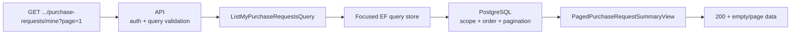

# Slice: List my purchase requests

## 0. Metadata

```text
Slice: ListMyPurchaseRequests
Technical operation: ListMyPurchaseRequests
Status: Planned
Branch: feature/purchase-request-drafts
Owner: PurchaseRequests module
Source documents: PF3 roadmap, PF3 stage README, PF3 draft slice index
```

## 1. Business problem

An Employee needs to return to existing requests instead of creating a new
request every time. Without a scoped list, the draft UI has no entry point and
would have to query details one request at a time.

This slice is successful when the backend returns the current user's requests
in the selected organization and branch, with stable ordering, server totals
and the stamp needed to open an editor.

## 2. Actor and resource scope

```text
Actor: authenticated Employee with active branch membership
Resource: request list owned by the current user
Organization scope: organizationId route matched with current membership
Branch scope: current membership branch; list must not cross branch scope in MVP
Authentication required: Yes
Authorization rule: author-owned requests only
```

The later submission branch may add status filters and broader read permissions.
This branch keeps the list focused on the author's own draft workflow.

## 3. Preconditions

- caller is authenticated;
- organization exists and is active;
- caller has an active Employee membership in the organization and branch;
- page and page size are within the agreed bounds.

## 4. Input and output contract

### Request

```text
HTTP method: GET
HTTP route: /api/organizations/{organizationId:guid}/purchase-requests/mine
Query: page? and pageSize?
Defaults: page=1, pageSize=20; maximum pageSize=100
```

### Successful response

```text
Status: 200 OK
Body: ApiResponse<PagedPurchaseRequestSummaryResponse>
State changes: none
Database writes: none
Ordering: UpdatedAt DESC, then Id DESC
```

Each summary includes id, branch, status, note preview if approved by the
contract, item count, server total, timestamps and concurrency stamp. The query
must project in PostgreSQL and must not load all requests into memory.

### Failure response

| Situation | Application result | HTTP result |
| --- | --- | --- |
| Missing authentication | Not handled by handler | `401` |
| Organization outside current membership | Not found or forbidden | `404` or `403` |
| Invalid page or page size | Validation error | `400` |
| No matching requests | Success with empty page | `200` |

## 5. Invariants

| Invariant | Owner | Protection |
| --- | --- | --- |
| No other author's request appears | Application/store | `AuthorUserId` predicate and API test |
| No other branch appears in MVP | Application/store | Branch predicate and PostgreSQL test |
| Ordering is deterministic | Infrastructure query | `UpdatedAt` plus `Id` tie-breaker |
| Pagination is database-side | Infrastructure query | SQL integration test/query inspection |
| Summary total comes from server state | Application view | Projection from persisted request total |
| List does not mutate drafts | Infrastructure | Read-only query |

## 6. Simplified flow



A list query is a read model for the draft screen. It does not become a generic
search endpoint or a substitute for the details query.

## 7. Existing code reconciliation

| Path | Classification | Current responsibility | Planned action |
| --- | --- | --- | --- |
| Existing project/task list query stores | REUSE AS PATTERN | Database filtering, stable ordering and pagination | Inspect conventions; do not reuse Project DTOs |
| `backend/Application/Modules/PurchaseRequests/ListMyPurchaseRequests/` | CREATE | Query, view and store port | Add organization/branch/author-scoped contract |
| `backend/Infrastructure/Modules/PurchaseRequests/ListMyPurchaseRequests/` | CREATE | EF projection and paging | Keep all filters and ordering database-side |
| `backend/API/Modules/PurchaseRequests/ListMyPurchaseRequests/` | CREATE | GET route and query validation | Return existing response-wrapper shape |
| `frontend/src/services/api/OrganizationApi.ts` | REUSE AS PATTERN | URL/query construction through `HttpClient` | Follow client naming and query conventions |

## 8. File plan

```text
Application:
    ListMyPurchaseRequestsQuery.cs
    IListMyPurchaseRequestsHandler.cs
    IListMyPurchaseRequestsStore.cs
    PagedPurchaseRequestSummaryView.cs

Infrastructure:
    ListMyPurchaseRequestsHandler.cs
    EfListMyPurchaseRequestsStore.cs
    author/branch/status indexes in PurchaseRequestConfiguration.cs

API:
    ListMyPurchaseRequestsController.cs
    ListMyPurchaseRequestsRequest/validator if required
    PagedPurchaseRequestSummaryResponse.cs

Tests:
    handler scope and paging tests
    API empty/list authorization tests
    PostgreSQL ordering and projection tests
```

## 9. Test plan

### Cheapest proving test

Create two requests for Employee A in Branch A and one request for Employee B
in Branch B. Query A's list and assert only A's two requests are returned in
`UpdatedAt DESC, Id DESC` order with server totals.

### Behavior matrix

| Behavior | Test | Expected proof |
| --- | --- | --- |
| Own requests appear | API/PostgreSQL | Correct summaries and totals |
| Other author excluded | API/PostgreSQL | No data leak |
| Other branch excluded | PostgreSQL/API | Branch isolation |
| Empty list | API/frontend | `200` with empty collection |
| Invalid page | API | `400` |
| Stable ordering | PostgreSQL | Tie-breaker is deterministic |
| Pagination | PostgreSQL | SQL returns requested page, not in-memory slicing |
| List is read-only | PostgreSQL | No row or stamp changes |

## 10. Checkpoints

```text
Checkpoint 0: confirm existing pagination/list response convention
    -> inspection
Checkpoint 1: scoped Application query and handler
    -> handler tests
Checkpoint 2: PostgreSQL projection and indexes
    -> list integration tests
Checkpoint 3: API route and frontend list screen
    -> API/frontend tests
Checkpoint 4: stale-item refresh path in details editor
    -> frontend/API conflict test
```
