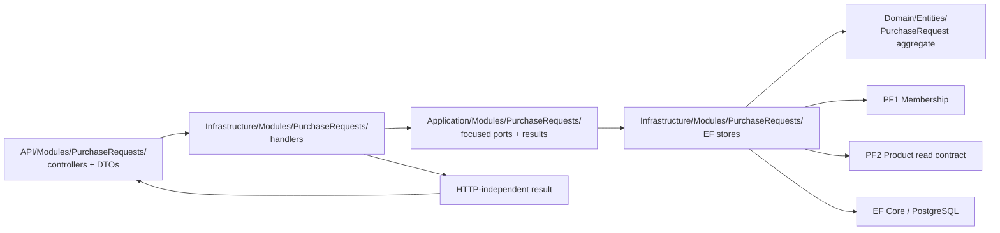

# File plan: purchase-request drafts

- Status: Planned
- Branch: `feature/purchase-request-drafts`
- Business result: an Employee can create and edit an own branch-scoped draft
- Technical boundary: `PurchaseRequests` module with focused vertical slices

This plan describes the smallest coherent change for the draft branch. Paths
marked `CREATE` do not exist in the current repository. Paths marked `REUSE` or
`VERIFY` are existing foundations and must be inspected before implementation.

## 1. Domain and persistence

| Path | Classification | Responsibility | Planned action |
| --- | --- | --- | --- |
| `backend/Domain/Entities/PurchaseRequest.cs` | CREATE | Aggregate status, scope, note, items, total and concurrency stamp | Add factory and aggregate mutation methods; keep EF constructor private |
| `backend/Domain/Entities/PurchaseRequestItem.cs` | CREATE | Product identity, historical snapshot, quantity and comment | Add item factory and quantity mutation; no direct public setters |
| `backend/Domain/Enums/PurchaseRequestStatus.cs` | CREATE | Lifecycle values | Define lifecycle values; implement only Draft creation/editability in this branch |
| `backend/Infrastructure/Data/ApplicationDbContext.cs` | MODIFY | DbSets and model discovery | Add `PurchaseRequests` and `PurchaseRequestItems` DbSets if required by the current convention |
| `backend/Infrastructure/Data/Configurations/PurchaseRequestConfiguration.cs` | CREATE | Aggregate table, FKs, indexes, precision and concurrency token | Configure branch/author scope, status, note, total, timestamps and stamp |
| `backend/Infrastructure/Data/Configurations/PurchaseRequestItemConfiguration.cs` | CREATE | Item table, snapshots, quantity and uniqueness | Configure `(PurchaseRequestId, ProductId)` uniqueness and check constraints |
| `backend/Infrastructure/Data/Migrations/<timestamp>_AddPurchaseRequests.cs` | CREATE | PostgreSQL schema | Generate only after the model and decision gates are confirmed; inspect SQL |
| `backend/Domain/Models/Organizations/Membership.cs` | REUSE | Business role, branch assignment and active state | Do not duplicate membership logic in PurchaseRequests |
| `backend/Domain/Models/Catalog/UnitOfMeasure.cs` | REUSE | Existing catalog reference foundation | Use only through the PF2 product read contract; do not make it a request item |
| `backend/Infrastructure/Data/Configurations/Organization/Membership/OrganizationMembershipConfiguration.cs` | VERIFY | Membership FK and active-user uniqueness | Confirm current access queries can prove organization and branch scope |

## 2. Application contracts and slices

| Path | Classification | Responsibility | Planned action |
| --- | --- | --- | --- |
| `backend/Application/Modules/PurchaseRequests/PurchaseRequestOperationStatus.cs` | CREATE | HTTP-independent application outcome status | Add `NotFound`, `ValidationError`, `Conflict` and `Forbidden` as needed |
| `backend/Application/Modules/PurchaseRequests/PurchaseRequestOperationResult.cs` | CREATE | Generic application result | Keep it independent of ASP.NET and `HttpStatusCode` |
| `backend/Application/Modules/PurchaseRequests/PurchaseRequestViews.cs` | CREATE | Details, item and list projections | Expose snapshots, derived total and concurrency stamp without Domain entities |
| `backend/Application/Modules/PurchaseRequests/CreatePurchaseRequest/` | CREATE | Create command, handler/store ports and result | Derive author and branch from current membership |
| `backend/Application/Modules/PurchaseRequests/AddPurchaseRequestItem/` | CREATE | Add command, handler/store port and selectable product view | Read PF2 product state and pass a server-owned snapshot to the aggregate |
| `backend/Application/Modules/PurchaseRequests/UpdatePurchaseRequestItemQuantity/` | CREATE | Quantity update command, handler and store port | Require the expected request stamp |
| `backend/Application/Modules/PurchaseRequests/RemovePurchaseRequestItem/` | CREATE | Remove command, handler and store port | Require the expected request stamp; allow an empty draft |
| `backend/Application/Modules/PurchaseRequests/GetPurchaseRequestDetails/` | CREATE | Scoped query, handler and store port | Return author-owned details and stored snapshots |
| `backend/Application/Modules/PurchaseRequests/ListMyPurchaseRequests/` | CREATE | Paginated query, handler and store port | Project own requests in PostgreSQL with stable ordering |

Each store port must describe one focused use-case need. Do not introduce a
shared `IRepository<T>` or expose `ApplicationDbContext` to a handler.

## 3. Infrastructure and module registration

| Path | Classification | Responsibility | Planned action |
| --- | --- | --- | --- |
| `backend/Infrastructure/Modules/PurchaseRequests/PurchaseRequestsModule.cs` | CREATE | Module DI registration | Register all draft handlers and focused EF stores |
| `backend/Infrastructure/Modules/PurchaseRequests/CreatePurchaseRequest/` | CREATE | Membership lookup, aggregate persistence and handler | Map current Employee membership to request scope |
| `backend/Infrastructure/Modules/PurchaseRequests/AddPurchaseRequestItem/` | CREATE | Product selection, snapshot read and aggregate persistence | Query only active/available products in organization scope |
| `backend/Infrastructure/Modules/PurchaseRequests/UpdatePurchaseRequestItemQuantity/` | CREATE | Scoped aggregate load and save | Catch `DbUpdateConcurrencyException` and return application conflict |
| `backend/Infrastructure/Modules/PurchaseRequests/RemovePurchaseRequestItem/` | CREATE | Scoped aggregate load and save | Preserve aggregate ownership and stale-version handling |
| `backend/Infrastructure/Modules/PurchaseRequests/GetPurchaseRequestDetails/` | CREATE | Read projection | Do not replace stored snapshots with current catalog fields |
| `backend/Infrastructure/Modules/PurchaseRequests/ListMyPurchaseRequests/` | CREATE | Database-filtered list projection | Apply scope, sort and pagination in PostgreSQL |
| `backend/API/Services/AddProjectServices.cs` | MODIFY | Composition root | Call `AddPurchaseRequestsModule()` beside existing module registrations |

## 4. API contracts and response mapping

| Path | Classification | Responsibility | Planned action |
| --- | --- | --- | --- |
| `backend/API/Modules/PurchaseRequests/<UseCase>/` | CREATE | Requests, validators, controllers and HTTP mapping | Keep route scope, auth and response mapping in API |
| `backend/API/Modules/PurchaseRequests/PurchaseRequestResponses.cs` | CREATE | API response DTOs | Map from Application views; never serialize Domain entities |
| `backend/API/Responses/OperationResultStatusCodeMapper.cs` | MODIFY | Application-status to HTTP mapping | Add a focused overload for `PurchaseRequestOperationStatus` |
| `backend/Shared/Responses/ApiResponse.cs` | REUSE | Existing HTTP response wrapper | Preserve the repository response contract |

The controller may choose `201`, `200` and `404` response details, but the
Application result must remain HTTP-independent. Validation must reject client
attempts to send author, branch, status, price or total fields.

## 5. Tests

| Path | Classification | Responsibility | Planned action |
| --- | --- | --- | --- |
| `backend/UnitTests/Domain/PurchaseRequestTests.cs` | CREATE | Aggregate state and total tests | Cover empty draft, item uniqueness, edit lock and stamp changes |
| `backend/UnitTests/Domain/PurchaseRequestItemTests.cs` | CREATE | Quantity and snapshot tests | Cover positive quantity, maximum and immutable snapshot behavior |
| `backend/UnitTests/Modules/PurchaseRequests/<UseCase>/` | CREATE | Handler tests | Mock focused ports and test scope, product state and conflicts |
| `backend/IntegrationTests/PurchaseRequestsApiInMemoryIntegrationTests.cs` | CREATE | HTTP/auth/contract tests | Cover author, branch and status mappings without PostgreSQL |
| `backend/IntegrationTests/PurchaseRequestsPostgreSqlIntegrationTests.cs` | CREATE | Database guarantees | Cover unique item index, precision, FK scope and stale versions |
| `backend/IntegrationTests/ModuleArchitectureIntegrationTests.cs` | VERIFY/MODIFY | Registration and dependency boundary | Extend only for the new module registration if required |
| `frontend/src/types/purchaseRequests.ts` | CREATE | TypeScript request/response contracts | Mirror API views; keep server total and stamp visible |
| `frontend/src/services/api/PurchaseRequestApi.ts` | CREATE | API client | Use `HttpClient`; expose `409` through existing `HttpError` |
| `frontend/src/pages/PurchaseRequestDrafts.tsx` | CREATE | Draft list and editor entry point | Cover loading, empty, error and refresh states |
| `frontend/src/tests/pages/PurchaseRequestDrafts.test.tsx` | CREATE | Page behavior | Cover item editing, server total and stale-version recovery |

## 6. Responsibility flow



## 7. Implementation order

```text
1. Confirm decision gates and nearest module/controller conventions
    -> 2. Domain aggregate and unit tests
        -> 3. EF configuration, migration and PostgreSQL schema tests
            -> 4. Application contracts and handlers
                -> 5. API routes, validators and response mapping
                    -> 6. In-memory and PostgreSQL integration tests
                        -> 7. Frontend client, types, page and tests
                            -> 8. Release build and regression suite
```

A red focused validation stops the next checkpoint. Submission remains a
separate branch and must start only after the draft branch is independently
valid.
