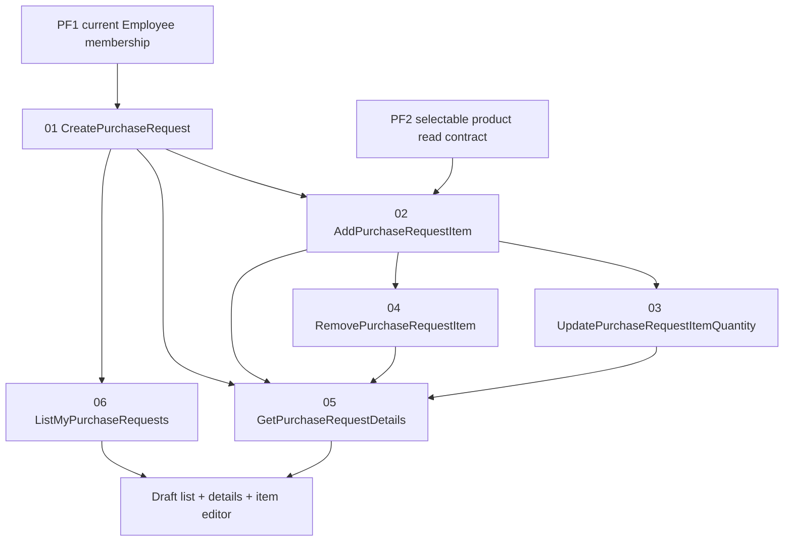

# Slices: PF3 purchase-request drafts

Implement one business result at a time. Every slice has one dominant
invariant, one cheapest proving test and an independently understandable
checkpoint. The branch ends with editable drafts; submission is a later branch.

```text
01 CreatePurchaseRequest
    -> create an empty Draft for the current Employee's branch

02 AddPurchaseRequestItem
    -> select one active/available catalog product and store its snapshot

03 UpdatePurchaseRequestItemQuantity
    -> change one line through the aggregate with an expected version

04 RemovePurchaseRequestItem
    -> remove one line without making an empty Draft invalid

05 GetPurchaseRequestDetails
    -> return only the author's scoped draft and its historical snapshots

06 ListMyPurchaseRequests
    -> return the author's own requests through a database projection
```

## Dependency order



Implement the Domain aggregate and its tests before the first HTTP endpoint.
Do not add `SubmitPurchaseRequest`, `CancelPurchaseRequest`, history records or
read-only submitted behavior to this branch.

## Shared rules for every slice

- `PurchaseRequest` is a new aggregate and is not a renamed `ProjectTask`.
- `AuthorUserId`, `OrganizationId` and `BranchId` come from trusted server-side
  membership state; the client cannot choose them.
- Only an active Employee in the request's organization and stored branch can
  create or edit a draft in this branch.
- Only the author may read or mutate a draft. Out-of-scope reads use the safe
  repository not-found behavior.
- The aggregate is the only owner of its item collection and total calculation.
- A draft may be empty until the submission branch applies the completeness
  rule.
- An item is unique by `ProductId` within one request. A second add returns a
  conflict; it does not silently replace or merge quantities.
- Add-item reads an active and available product in the same organization and
  copies name, optional code, unit and price into the item snapshot.
- Clients never provide `Status`, `UnitPriceSnapshot` or `TotalValue`.
- Every mutation after creation requires a non-empty expected
  `ConcurrencyStamp`; both the handler check and EF concurrency token are
  required.
- A successful aggregate mutation changes the stamp and recalculates the total.
- Stores expose focused application ports and do not return HTTP status codes.
- PostgreSQL owns final foreign-key, unique-index, check-constraint and
  optimistic-concurrency protection.

## Detailed slice plans

- [01 CreatePurchaseRequest](01_create-purchase-request.md)
- [02 AddPurchaseRequestItem](02_add-purchase-request-item.md)
- [03 UpdatePurchaseRequestItemQuantity](03_update-purchase-request-item-quantity.md)
- [04 RemovePurchaseRequestItem](04_remove-purchase-request-item.md)
- [05 GetPurchaseRequestDetails](05_get-purchase-request-details.md)
- [06 ListMyPurchaseRequests](06_list-my-purchase-requests.md)

The minimal frontend is a branch-level checkpoint after the backend slices. It
contains a list, details view, product selector, item editor, loading/empty/
error states and a stale-version refresh path. It does not expose submission
or cancellation controls yet.

## Validation order

1. Domain aggregate and item unit tests.
2. Handler tests with focused store ports.
3. In-memory API tests for authentication, scope and response contracts.
4. PostgreSQL tests for FK/index/precision behavior and stale-version conflicts.
5. Frontend API client, page tests, typecheck and production build.
6. Release build and the existing regression suite.

A Docker/Testcontainers failure blocks proof of PostgreSQL guarantees; it is not
evidence that a database invariant works.
